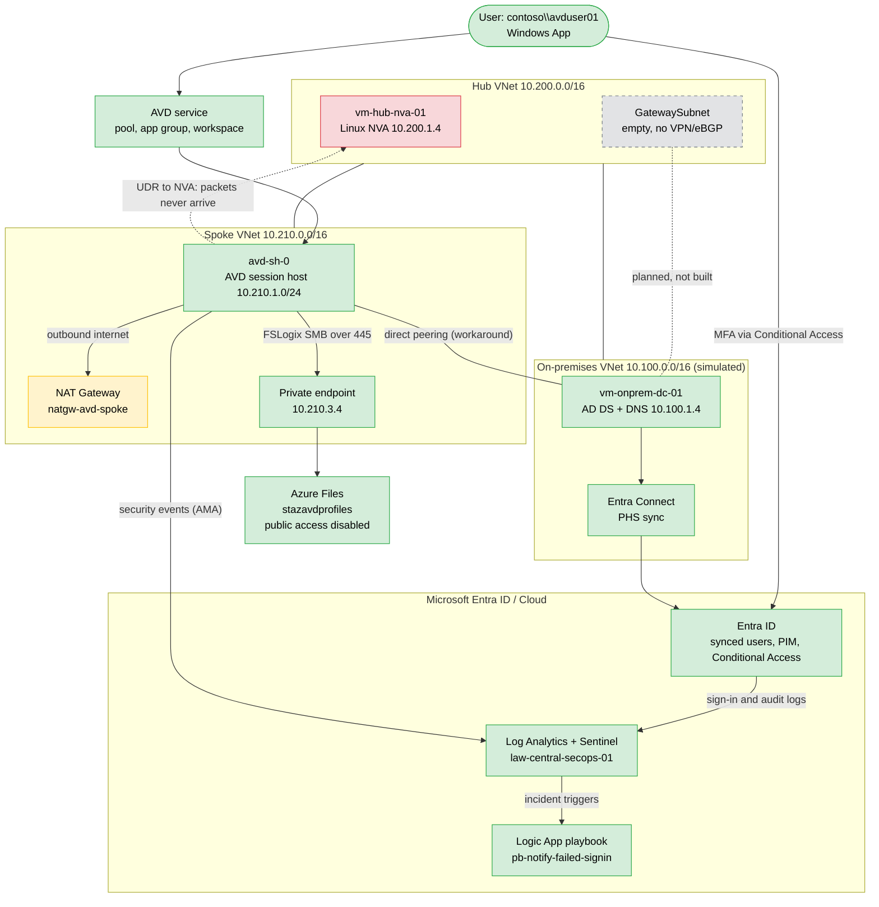

# azure-zerotrust-avd-landingzone

Hybrid Azure Virtual Desktop landing zone built as a hands-on lab: simulated on-premises
Active Directory, hub-spoke networking with a Linux NVA, Entra Connect hybrid identity,
Azure Files with AD-based Kerberos and FSLogix, a Sentinel-based SecOps layer, and
private access to storage. Deployed mostly with PowerShell and Azure CLI.

> **Status:** working end to end, with one documented open issue (NVA forwarding path).
> See [Known limitations](#known-limitations) and [Phase 8](docs/phase-8-nva-troubleshooting/README.md).

## What works

- A domain user (`contoso\avduser01`) signs in through the Windows App to a domain-joined
  session host, and an FSLogix profile container is created on Azure Files.
- Storage is reachable only over a private endpoint (`10.210.3.4`); public network access is
  disabled and outside requests are refused (`AuthorizationFailure`).
- Sign-in and Windows security events flow into Microsoft Sentinel. A custom analytics rule
  raises an incident for repeated failed sign-ins and an automation rule runs a playbook that
  sends an email.
- PIM (just-in-time Security Administrator) and Conditional Access (MFA for AVD users,
  legacy authentication blocked) are enforced, with a break-glass account excluded.

## Architecture

### As-built inventory

The diagram above shows the intended design and its status. The picture below is Azure's own
Resource Visualizer for the subscription, taken before teardown, and shows what actually existed.

| Resource group | Contents |
|---|---|
| rg-onprem-infra-01 | vnet-onprem-prod-01, vm-onprem-dc-01 (NIC, NSG, public IP, OS disk), boot diagnostics storage account |
| rg-hub-network-01 | vnet-hub-prod-01, vm-hub-nva-01 (NIC, NSG, public IP, OS disk), law-central-secops-01, Sentinel solution, dcr-avd-winsecurity, pb-notify-failed-signin (API connections: azuresentinel, outlook), stcapnva8293 (packet capture storage) |
| rg-spoke-avd-01 | vnet-spoke-avd-prod-01, avd-sh-0, vm-spoke-test (NIC, NSG, OS disk), rt-spoke-to-hub, natgw-avd-spoke, nat-pip, AVD host pool, application group and workspace, pe-stazavdprofiles-file (and NIC), privatelink.file.core.windows.net |
| rg-avd-storage-01 | stazavdprofiles |
| NetworkWatcherRG | NetworkWatcher_centralindia |

Notes on what the visualizer does and does not show:

- It does not draw VNet peerings or private DNS zone links, so it cannot be used to verify them.
  Those are evidenced in the Phase 2, 2b and 7 screenshots.
- vm-spoke-test has its own NSG (vm-spoke-test-nsg). Its default rules allow VNet traffic, so
  it does not change the Phase 8 diagnosis.

| VNet | Address space | Purpose |
|---|---|---|
| vnet-onprem-prod-01 | 10.100.0.0/16 | Simulated on-premises, domain controller |
| vnet-hub-prod-01 | 10.200.0.0/16 | Hub, Linux NVA |
| vnet-spoke-avd-prod-01 | 10.210.0.0/16 | AVD session hosts, private endpoint subnet |

## Phases

| Phase | Topic | Status | Notes |
|---|---|---|---|
| **[1](docs/phase-1-onprem-adds/README.md)** | Simulated on-prem AD DS | Done | |
| **[2](docs/phase-2-hub-spoke-nva/README.md)** | Hub-spoke with Linux NVA | Partial | Replaced Azure Firewall for cost. NVA path does not forward spoke traffic (Phase 8) |
| **[2b](docs/phase-2-hub-spoke-nva/README.md)** | On-prem connectivity | Done (lab shortcut) | Added retroactively: direct VNet peering and DNS, because no phase linked on-prem to the hub |
| **[3](docs/phase-3-hybrid-identity/README.md)** | Hybrid identity (Entra Connect) | Done | |
| **[4](docs/phase-4-azure-files/README.md)** | Azure Files, Kerberos, NTFS | Done | Private endpoint deferred to Phase 7 |
| **[5](docs/phase-5-avd-fslogix/README.md)** | AVD host pool and FSLogix | Done | Egress uses a NAT Gateway (workaround) |
| **[6](docs/phase-6-secops/README.md)** | SecOps: PIM, Conditional Access, Sentinel, SOAR | Done | |
| **[7](docs/phase-7-zerotrust-storage/README.md)** | Zero-trust storage | Done | Private endpoint, private DNS, public access disabled |
| **[8](docs/phase-8-nva-troubleshooting/README.md)** | NVA path troubleshooting | Open | Case study, escalated to Microsoft Q&A [add link] |

## How this differs from the original plan

The original roadmap listed six phases. Three things changed, and they are documented rather
than smoothed over:

1. **Azure Firewall was replaced by a Linux NVA** to keep costs down. The NVA never became a
   working egress or inspection point (Phase 8), so a NAT Gateway carries session-host egress.
2. **A phase was missing.** Nothing in the plan connected the on-prem VNet to the hub and spoke,
   which blocked the session host's domain join. Direct peering was added as Phase 2b.
3. **Private endpoints were skipped in Phase 4** and built in Phase 7 once the rest worked.

## Known limitations

- **NVA path unresolved:** packets from a UDR-routed spoke subnet never reach the NVA's NIC.
  Route, peering, NSG (IP flow verify), NIC forwarding and the NVA's own configuration all check
  out. Full evidence in Phase 8.
- **No VPN or eBGP.** The original design called for both. The on-prem link is plain VNet peering.
- **Spoke-to-on-prem traffic bypasses the NVA** through direct peering.
- **Playbook uses a user OAuth connection**, which can expire. A managed identity is the
  production choice.
- **NTFS ACLs on the profile share root are broader than needed** (Authenticated Users has Modify).
- **Lab VMs had public IPs** for administration, restricted or removed during cleanup.
- Defender for Cloud paid plans were not enabled, to avoid cost (foundational CSPM only).

## Cost notes

-Premium Azure Files has a 100 GiB minimum, billed regardless of use.

-NAT Gateway, Standard public IPs and the private endpoint bill by the hour. 

-Sentinel ran inside the 30-day free trial with a 1 GB/day ingestion cap on the workspace. 

## Repository layout

[Adjust to your real structure]

    docs/
      phase-1-onprem-adds/README.md
      phase-2-hub-spoke-nva/README.md
      phase-3-hybrid-identity/README.md
      phase-4-azure-files/README.md
      phase-5-avd-fslogix/README.md
      phase-6-secops/README.md
      phase-7-zerotrust-storage/README.md
      phase-8-nva-troubleshooting/README.md
      images/phase-X/NN-phaseX-title.png
      evidence/

## Screenshots and redaction

Tenant name, email addresses, subscription and tenant IDs, and any credentials are blurred or
removed. No keys, tokens or passwords are committed.

