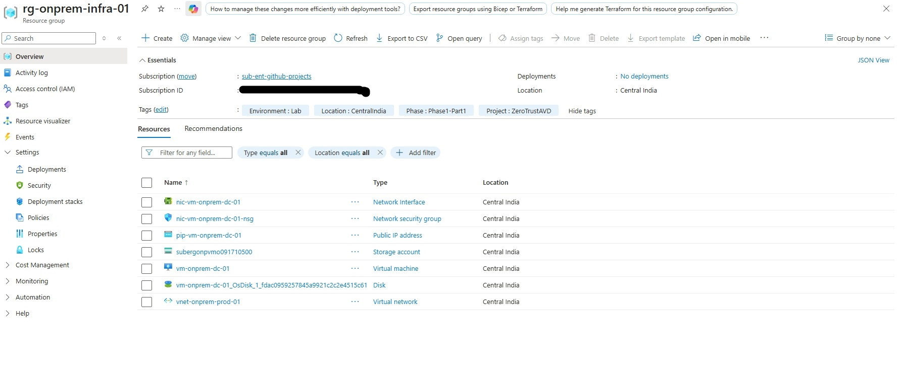
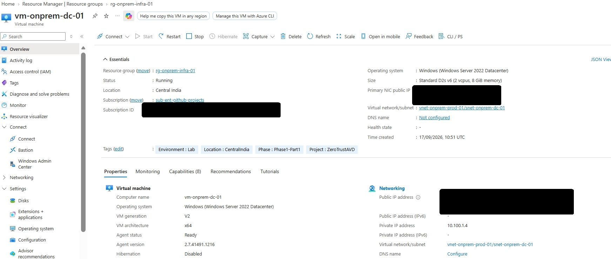
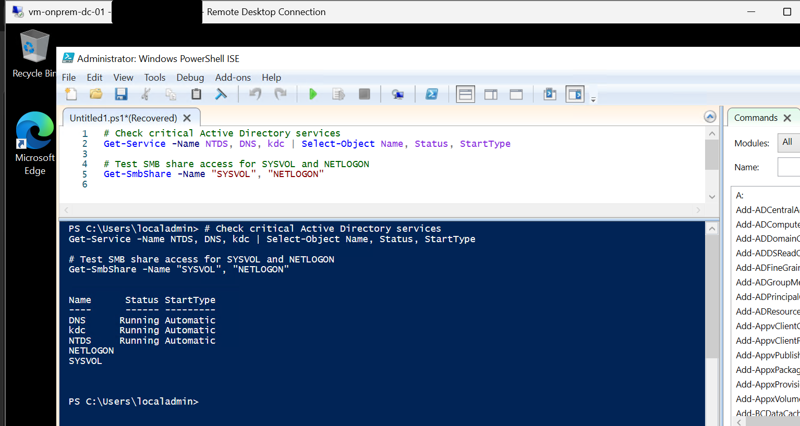
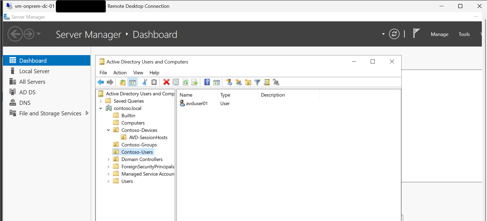
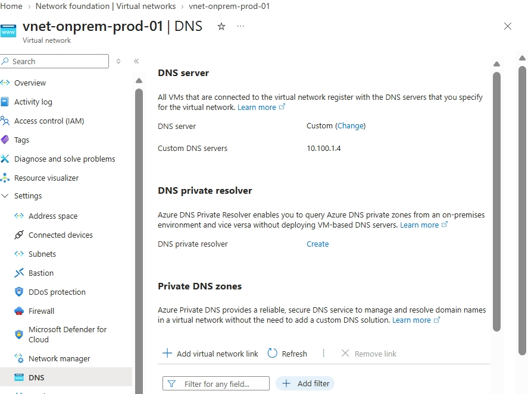

# Phase 1: Simulated On-Premises Infrastructure and AD DS

**Status:** Done. A single domain controller for `contoso.local` running in its own VNet,
standing in for an on-premises environment.

## Scope

- A separate resource group and VNet to play the role of "on-premises"
- One Windows Server VM promoted to a domain controller (AD DS and DNS)
- OU structure and a test user
- VNet DNS pointing at the domain controller

This phase stands alone. It is not connected to any Azure hub or spoke; that connection was
missing from the original plan and was added later as
[Phase 2b](../phase-2-hub-spoke-nva/README.md#phase-2b-on-premises-connectivity-added-retroactively).

## Architecture

| Item | Value |
|---|---|
| Resource group | rg-onprem-infra-01 |
| VNet | vnet-onprem-prod-01, 10.100.0.0/16 |
| Subnet | snet-on-prem-dc, 10.100.1.0/24 |
| Domain controller | vm-onprem-dc-01, Windows Server [2022], Standard_D2s_v6, static IP 10.100.1.4 |
| Domain | contoso.local |
| Region | Central India |

## Implementation

### 1. Resource group and core resources

The resource group holds the VNet, NIC, NSG, public IP, storage account (boot diagnostics) and
the domain controller VM.

### 2. Domain controller VM

Windows Server on `Standard_D2s_v6` with a static private IP (10.100.1.4), so the address other
resources use for DNS never changes.

### 3. AD DS promotion and service check

After promoting the server to a domain controller for a new forest (`contoso.local`), the core
services and shares were verified:

    Get-Service NTDS, DNS, kdc
    Get-SmbShare SYSVOL, NETLOGON

NTDS, DNS and kdc are running with automatic startup; SYSVOL and NETLOGON are shared.

### 4. OU structure and test objects

Organizational units under `contoso.local`: `Contoso-Devices` (with `AVD-SessionHosts` beneath
it), `Contoso-Groups` and `Contoso-Users`, with a test user (`avduser01`).

### 5. VNet DNS

The VNet's DNS setting was changed from Azure-provided to a custom server, 10.100.1.4, so
anything in this VNet resolves `contoso.local`.

## Verification

| Check | Result |
|---|---|
| NTDS, DNS, kdc services | Running |
| SYSVOL, NETLOGON shares | Present |
| OU structure and test user | Present |
| VNet DNS | 10.100.1.4 |

## Known issues

- **The domain controller has a public IP** for administration. The NSG allowed RDP from the
  internet during the build. It was restricted or removed at cleanup. In
  a real environment the DC would have no public IP and admin access would go through Bastion
  or a jump host.
- **A single domain controller** with no replication partner. Fine for a lab, but a real
  forest has at least two.
- **The DC is the only DNS server** for every VNet that later peers with it, so DNS for the
  session host and the private DNS zone forwarder depends on this one VM.
- Later phases add to this environment: the storage account computer object (Phase 4), the
  session host computer object (Phase 5) and a DNS conditional forwarder (Phase 7).

## Lessons

- A phase that passes its own checks can still leave a dependency out. Nothing here needed a
  link to Azure, so nothing flagged that none existed.
- Give the domain controller a static IP before pointing DNS at it.
- Record the exact resource names as built. Later phases, scripts and screenshots all depend on them.
