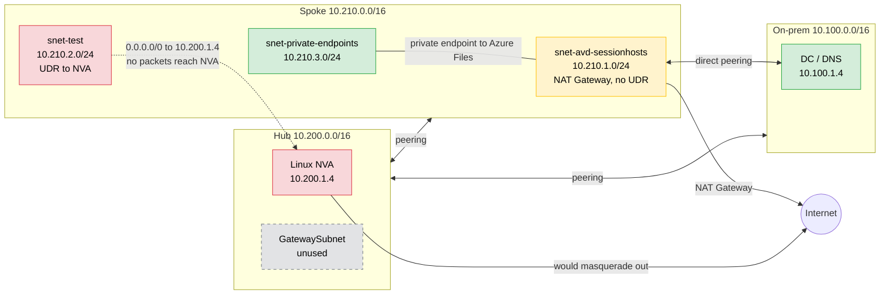
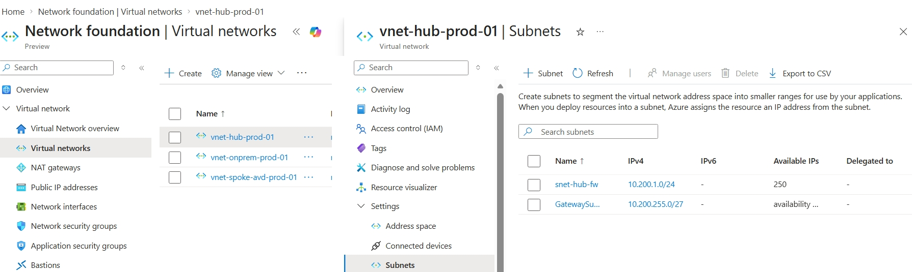
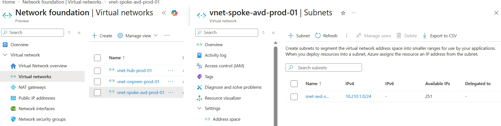
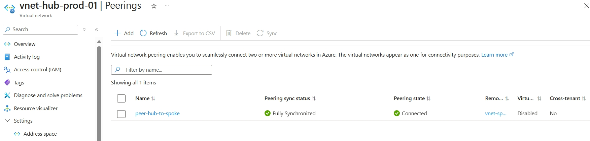
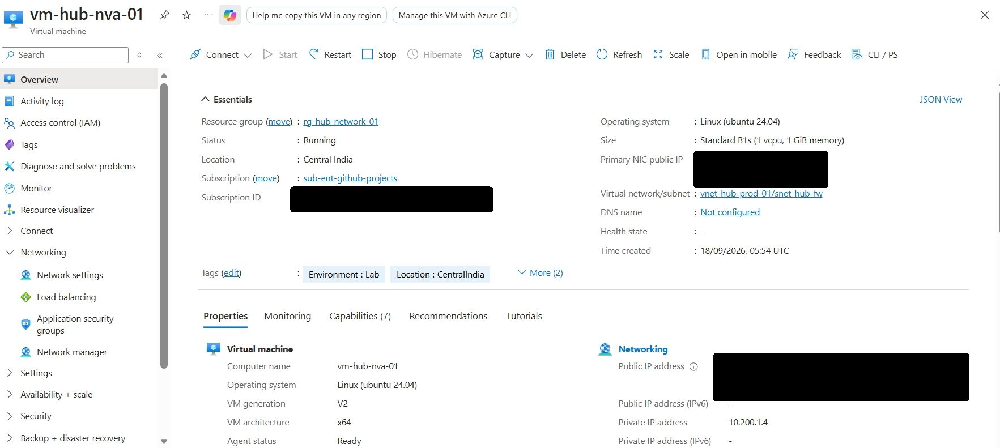
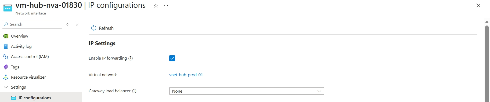
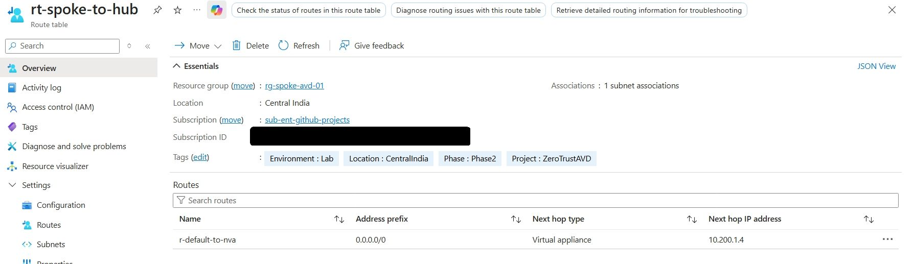
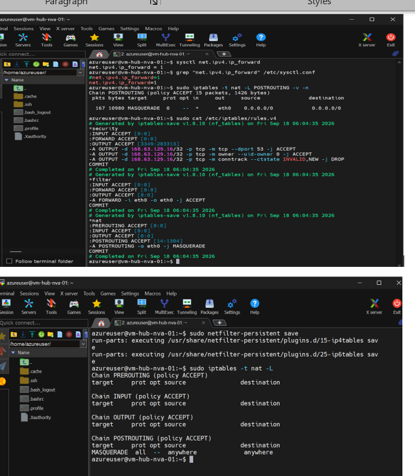
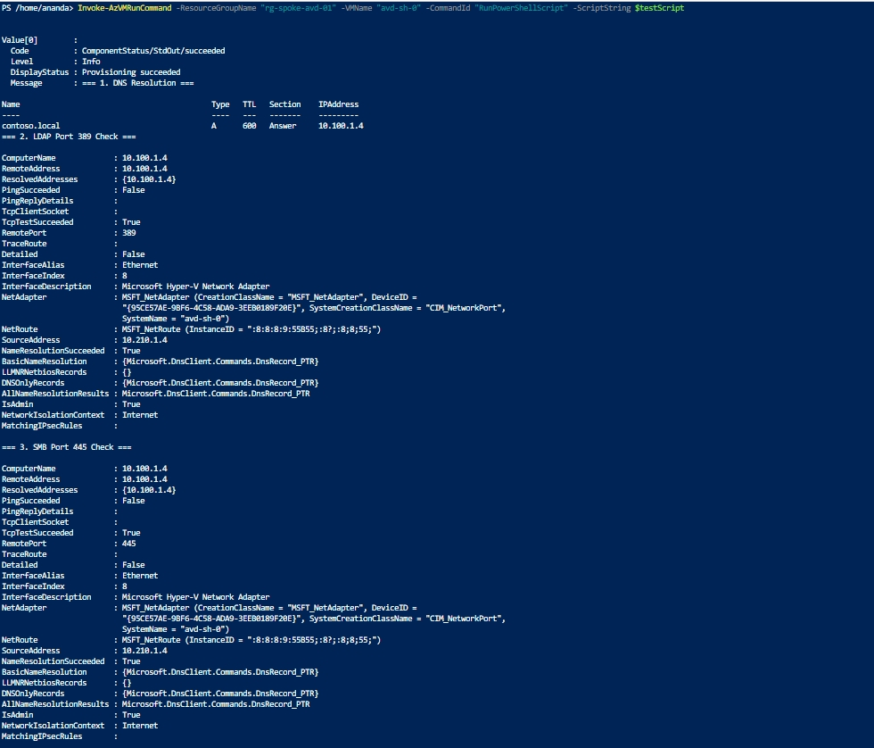

# Phase 2: Hub-Spoke Core Architecture with a Linux NVA

**Status:** Built, with one open issue. The NVA is configured correctly, but spoke traffic
does not reach it. See [Phase 8](../phase-8-nva-troubleshooting/README.md).

## Design change from the original plan

The roadmap called for Azure Firewall in the hub. I replaced it with a Linux NVA
(Ubuntu 24.04, `Standard_B1s`) for cost reasons, using kernel IP forwarding and iptables
masquerade in place of a managed firewall. That trade-off is why this phase carries an open
issue: a managed firewall would not have needed a hand-built forwarding path.

## Architecture and address plan




| Item | Value |
|---|---|
| Hub VNet | vnet-hub-prod-01, 10.200.0.0/16 |
| snet-hub-fw | 10.200.1.0/24 (NVA) |
| GatewaySubnet | 10.200.255.0/27 (reserved, unused: no VPN gateway was built) |
| Spoke VNet | vnet-spoke-avd-prod-01, 10.210.0.0/16 |
| snet-avd-sessionhosts | 10.210.1.0/24 |
| NVA | vm-hub-nva-01, private IP 10.200.1.4 |
| Route table | rt-spoke-to-hub, route r-default-to-nva: 0.0.0.0/0 -> VirtualAppliance 10.200.1.4 |

## Implementation

### 1. Hub and spoke VNets




### 2. VNet peering

Bidirectional peering with forwarded traffic allowed on both sides.



### 3. Linux NVA

An Ubuntu Server 24.04 VM in snet-hub-fw with a static private IP.



### 4. IP forwarding on the NVA NIC

Azure drops packets not addressed to a NIC's own IP unless forwarding is enabled on the NIC.



### 5. User-defined route

rt-spoke-to-hub sends 0.0.0.0/0 to the NVA.



### 6. Kernel forwarding and NAT on the NVA

    sudo sysctl -w net.ipv4.ip_forward=1
    echo 'net.ipv4.ip_forward=1' | sudo tee -a /etc/sysctl.conf
    sudo iptables -t nat -A POSTROUTING -o eth0 -j MASQUERADE
    sudo iptables -A FORWARD -j ACCEPT
    sudo apt install -y iptables-persistent && sudo netfilter-persistent save



## Verification

| Check | Result |
|---|---|
| Peering | Connected, forwarded traffic allowed both ways |
| NIC IP forwarding | True |
| net.ipv4.ip_forward | 1 (survives restart) |
| iptables | MASQUERADE on eth0; FORWARD ACCEPT (persisted) |
| NVA reaches the internet itself | HTTP 200 to the test URL |
| **Spoke VM reaches the internet through the NVA** | **Fails** (see below) |

### The check that was missing

The original acceptance list stopped at the NVA's own configuration.

<u>_It never tested the one thing the NVA exists for: a spoke VM reaching the internet through it_.</u> 

That test was first run in Phase 5, when the session host's extension could not download its configuration, and it
failed. I added it here retroactively as an acceptance criterion:

- [x] NVA OS forwarding and masquerade verified
- [x] NVA itself reaches the internet
- [ ] A spoke VM reaches the internet through the NVA, with packets visible on the NVA's eth0

## Known issue

Packets from a UDR-routed spoke subnet never reach the NVA. Route, peering, NSG (IP flow
verify), NIC forwarding and the NVA's own configuration all check out, and the source VM emits
the packets. Full evidence and next steps in [Phase 8](../phase-8-nva-troubleshooting/README.md).

## Phase 2b: On-premises connectivity (added retroactively)

**Why this exists.** The original plan had no phase connecting the on-premises VNet to the hub
or spoke. Nothing in Phases 1 to 4 needed it, because each was verified in isolation. Phase 5
did: an AD-joined session host has to reach the domain controller for DNS, LDAP, Kerberos and
the domain join. The session host stayed a workgroup machine until this was added.

**What was built** (a lab shortcut, not the intended design):

- Peerings on-prem <-> hub and spoke <-> on-prem, forwarded traffic allowed, no gateway transit.
- Spoke VNet DNS set to the domain controller (10.100.1.4), then the session host restarted
  to pick it up.

```
$vnetOnPrem = Get-AzVirtualNetwork -ResourceGroupName rg-onprem-infra-01 -Name vnet-onprem-prod-01
$vnetHub = Get-AzVirtualNetwork -ResourceGroupName rg-hub-network-01 -Name vnet-hub-prod-01
$vnetSpoke = Get-AzVirtualNetwork -ResourceGroupName rg-spoke-avd-01 -Name vnet-spoke-avd-prod-01
Add-AzVirtualNetworkPeering -Name peer-onprem-to-hub -VirtualNetwork $vnetOnPrem -RemoteVirtualNetworkId $vnetHub.Id -AllowForwardedTraffic
Add-AzVirtualNetworkPeering -Name peer-hub-to-onprem -VirtualNetwork $vnetHub -RemoteVirtualNetworkId $vnetOnPrem.Id -AllowForwardedTraffic
Add-AzVirtualNetworkPeering -Name peer-spoke-to-onprem -VirtualNetwork $vnetSpoke -RemoteVirtualNetworkId $vnetOnPrem.Id -AllowForwardedTraffic
Add-AzVirtualNetworkPeering -Name peer-onprem-to-spoke -VirtualNetwork $vnetOnPrem -RemoteVirtualNetworkId $vnetSpoke.Id -AllowForwardedTraffic
$vnetSpoke.DhcpOptions.DnsServers = @("10.100.1.4")
Set-AzVirtualNetwork -VirtualNetwork $vnetSpoke  
```

**Verification from the session host:** contoso.local resolves to 10.100.1.4, and TCP 389 and
445 to the domain controller succeed.



**Trade-off.** The direct spoke <-> on-prem peering bypasses the NVA, so there is no
inspection point between the two. The intended design (site-to-site VPN with BGP, traffic
forced through the hub) was not built.

## Workarounds carried forward

| Need | Workaround | Bypasses the NVA |
|---|---|---|
| Session-host internet egress | NAT Gateway on snet-avd-sessionhosts, route table detached | Yes |
| Session host to domain controller | Direct spoke <-> on-prem peering | Yes |

## Lessons

- Each phase passed its own checklist and still failed the next one. Acceptance criteria should
  test the path a later phase depends on, not just the component built.
- Peering is not transitive, and a UDR to an NVA overrides a NAT Gateway on the same subnet.
- Verify egress end to end, from a workload VM, before building on top of a network path.


