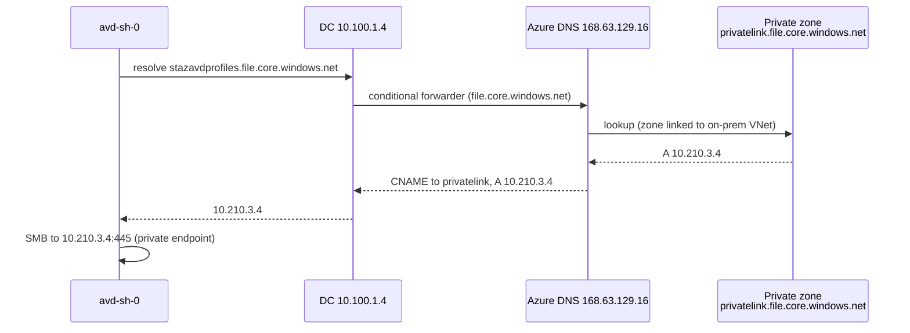
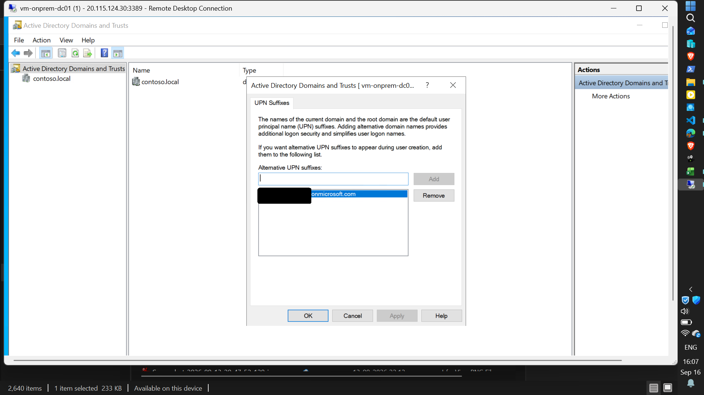
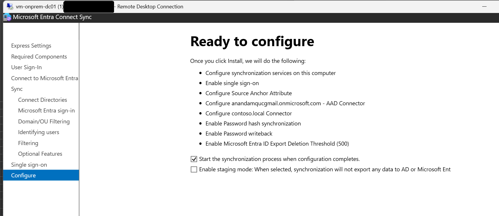
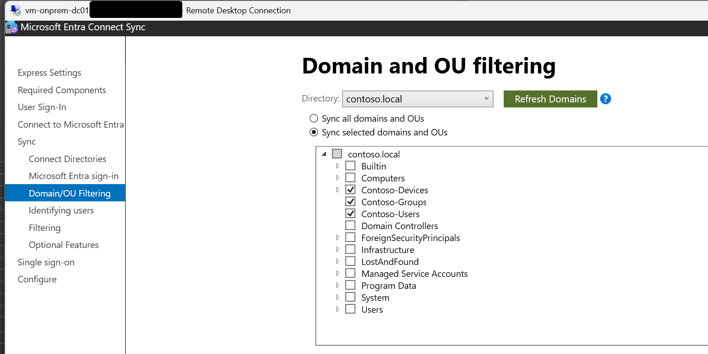
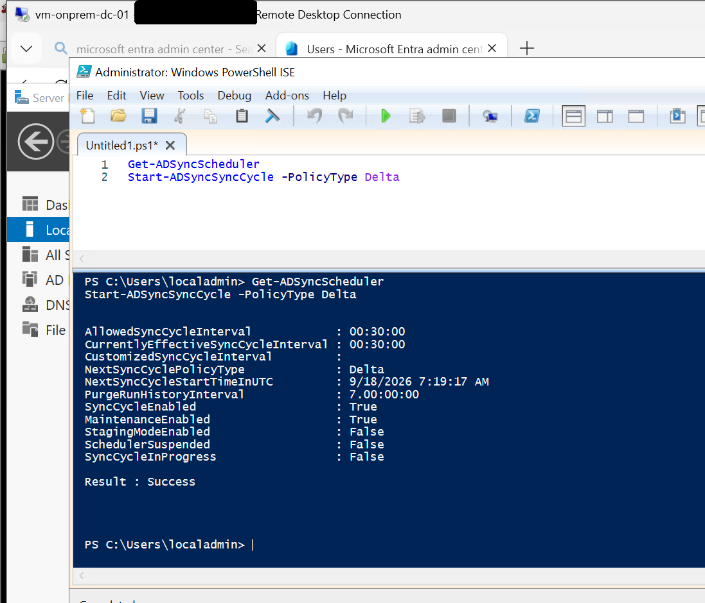

# Phase 3: Hybrid Identity and Microsoft Entra Connect

**Status:** Done. On-premises users and groups sync to Microsoft Entra ID with password hash
synchronization, and the synced test user signs in to Azure and AVD with cloud MFA.

## Scope

- An alternative UPN suffix so on-premises accounts can sign in with a routable cloud domain
- Microsoft Entra Connect with password hash synchronization
- OU-scoped synchronization
- Verification of the sync cycle

## Architecture

| Item | Value |
|---|---|
| On-premises domain | contoso.local (non-routable) |
| UPN suffix added | [tenant].onmicrosoft.com |
| Sign-in method | Password hash synchronization [and seamless SSO, if you enabled it] |
| Sync scope | OUs: Contoso-Users, Contoso-Groups, Contoso-Devices |
| Entra Connect server | vm-onprem-dc-01 [confirm: installed on the domain controller] |

`contoso.local` cannot be verified as a public domain, so on-premises users cannot use it to
sign in to Entra ID. Adding the tenant's `onmicrosoft.com` domain as an alternative UPN suffix,
and setting users' UPNs to it, lets them authenticate to the cloud with the same credentials.

## Implementation

### 1. Alternative UPN suffix

The suffix was added in Active Directory Domains and Trusts (right-click the root node,
Properties, UPN Suffixes) and then applied to the test users.

### 2. Microsoft Entra Connect

Installed with custom settings: password hash synchronization as the sign-in method, forest
connected with an account that has the required permissions, and the tenant connected with a
Global Administrator.

### 3. OU filtering

Synchronization was limited to the workload OUs so built-in containers and system accounts stay
out of the cloud directory:

- Contoso-Users
- Contoso-Groups
- Contoso-Devices

### 4. Sync verification

The scheduler was checked and a delta synchronization was started by hand:

    Get-ADSyncScheduler
    Start-ADSyncSyncCycle -PolicyType Delta

## Verification

| Check | Result |
|---|---|
| Alternative UPN suffix present in the forest | Yes |
| Users and groups from the three OUs in Entra ID, source "Windows Server AD" | [add a portal screenshot] |
| Scheduler enabled, delta cycle runs | Yes |
| A synced user signs in with cloud MFA | Yes, confirmed in Phases 5 and 6 (avduser01) |

The strongest evidence for this phase turned up later: `avduser01` (a synced account) signed in
to the Windows App, was challenged for MFA by a Conditional Access policy, and mounted an
FSLogix profile. None of that works without a working sync.

## Design notes

- **The `computer` objects were included in the sync scope** because `Contoso-Devices` is
  selected. Devices are not joined to Entra ID by this sync (session hosts are AD-joined, not
  hybrid-joined), so the device objects are unused. Scope them out or enable hybrid join if a
  later phase needs device-based Conditional Access.
- **Password hash sync stores a hash of the on-premises hash in Entra ID.** It was chosen for
  simplicity in a lab. Pass-through authentication or federation are alternatives.
- **Group membership drives access:** `grp-avd-users` syncs to Entra ID, and it is the target
  of the Conditional Access MFA policy and the AVD application group assignment.

## Issues and fixes

| Issue | Cause | Fix |
|---|---|---|
| [Add any you hit during install] | | |

## Known limitations

- Entra Connect runs on [the domain controller], which is not recommended outside a lab.
- One Entra Connect server and no staging server.
- Synced users are subject to the on-premises lockout policy, which affected failed-sign-in
  testing in Phase 6.

## Lessons

- A non-routable domain (`.local`) needs an alternative UPN suffix before users can sign in to
  the cloud. Do this before the first sync, not after.
- Scope the sync by OU from the start. Removing objects from scope later means deletes in the
  cloud directory.
- The real test of a sync is a user that signs in end to end, not the green tick in the wizard.

