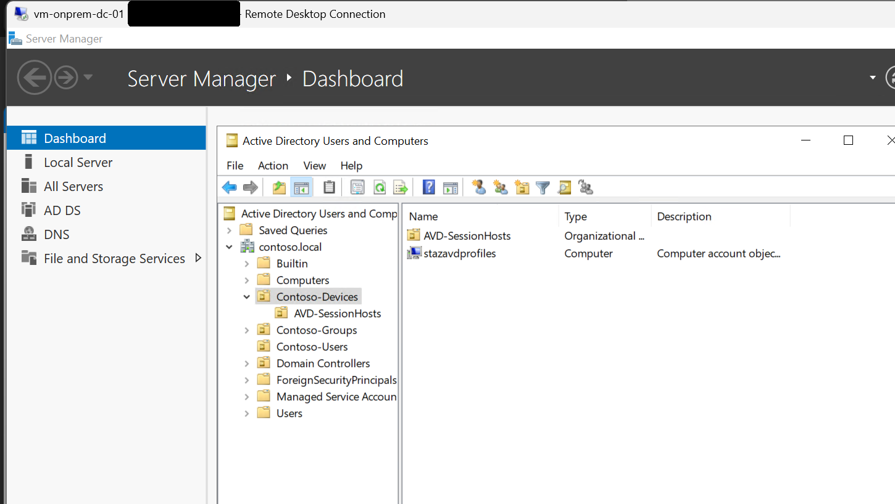
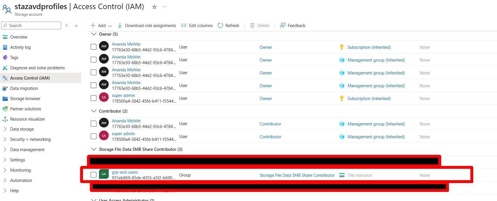
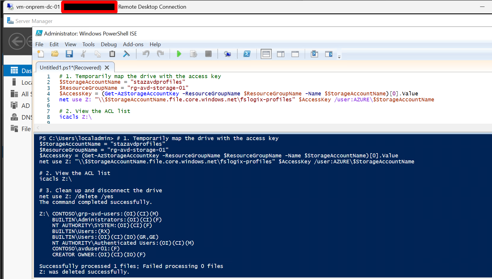
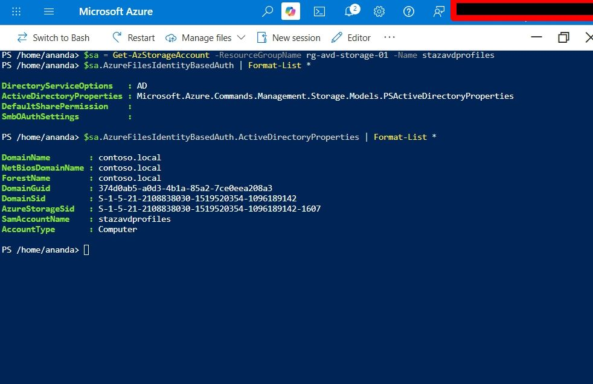

# Phase 4: Azure Files, Kerberos and FSLogix Permissions

**Status:** Done. The private endpoint originally planned for this phase was deferred and built
in [Phase 7](../phase-7-zerotrust-storage/README.md). Until then, storage ran on its public
endpoint.

## Scope

- A Premium FileStorage account for FSLogix profile containers
- Storage account joined to the on-premises AD domain (contoso.local) for Kerberos
- Share-level RBAC and NTFS permissions

The roadmap listed private endpoints under this phase. That did not happen here (see
"What was deferred").

## Architecture

| Item | Value |
|---|---|
| Storage account | stazavdprofiles, Premium FileStorage, Central India |
| Resource group | rg-avd-storage-01 |
| File share | fslogix-profiles, 100 GiB provisioned (Premium minimum) |
| Domain | contoso.local |
| AD object | Computer account stazavdprofiles in OU=Contoso-Devices |
| Users | grp-avd-users |

## Implementation

### 1. Storage account and domain join

The storage account was created as Premium FileStorage and joined to contoso.local with the
AzFilesHybrid module, creating a computer account in `OU=Contoso-Devices`.



### 2. Share-level RBAC

grp-avd-users was assigned Storage File Data SMB Share Contributor on the share.



### 3. NTFS permissions

The share was mounted temporarily with the storage account key so NTFS ACLs could be set
(the account key path works before Kerberos is usable from the machine doing the setup).
`CONTOSO\grp-avd-users` received Modify with inheritance.

```
net use Z: "\stazavdprofiles.file.core.windows.net\fslogix-profiles" <key> /user:AZURE\stazavdprofiles
icacls Z:
net use Z: /delete /yes
```



## Verification

- The share-level role and NTFS permissions are in place (screenshots above).
- End-to-end proof came in Phase 5: `contoso\avduser01` signed in and FSLogix created a profile
  folder and VHDX on this share.
- Identity configuration on the storage account:
```
$sa = Get-AzStorageAccount -ResourceGroupName rg-avd-storage-01 -Name stazavdprofiles
$sa.AzureFilesIdentityBasedAuth | Format-List *
```

  Expected: `DirectoryServiceOptions : AD`, with `ActiveDirectoryProperties` showing
  `DomainName contoso.local`.



## What went wrong, and what was deferred

**NTFS setup failed with "Access is denied" until public access was opened.** The storage
firewall was blocking the domain controller, whose only route to the storage account was
over the internet. Opening public network access got past it. It stayed open, which left the
phase short of its own goal.

**The private endpoint was skipped.** Nothing in this phase forced it, so it was left off.
It was built afterward in Phase 7, together with private DNS, a DNS forwarder on the domain
controller, and disabling public access.


## Known issues

- **The ACL on the share root is broader than needed.** Authenticated Users and BUILTIN\Users
  hold entries beyond grp-avd-users, so any authenticated domain user can write to the root.
  FSLogix's recommended layout gives users create rights and lets CREATOR OWNER own per-user
  folders. Tightening this is a follow-up.
- **The storage account key was used for setup.** It has since been rotated.
- Individual users (not only the group) appear in the IAM role list. Fine for a lab.

## Lessons

- A private endpoint is not something to "add later" if setup steps depend on the public path.
  Decide up front how administrative access works once public access is closed.
- Confirm a hybrid-joined storage account with PowerShell, not the portal. The portal blade
  shows only "Configured".
- Set NTFS permissions from a machine that has a network path to the share, not from a laptop.

