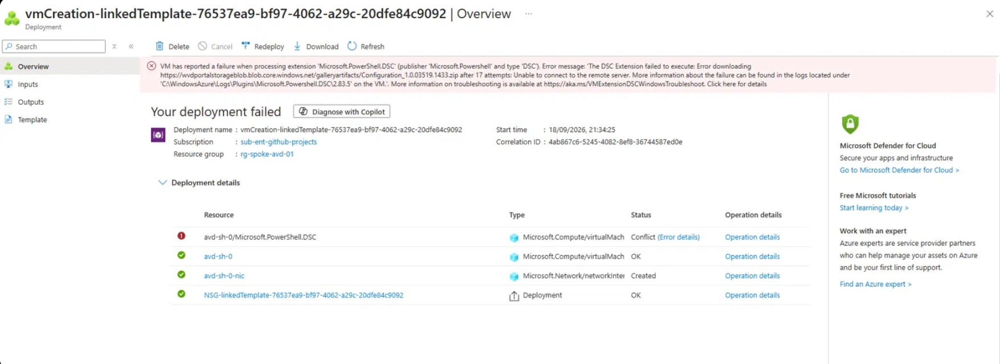
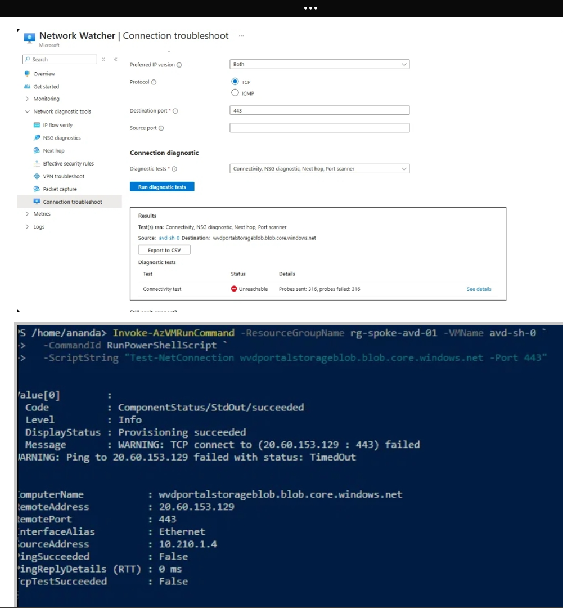
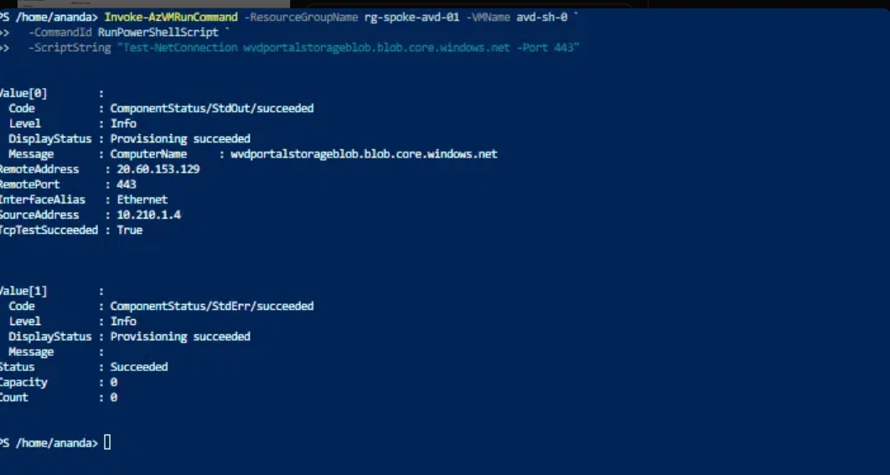
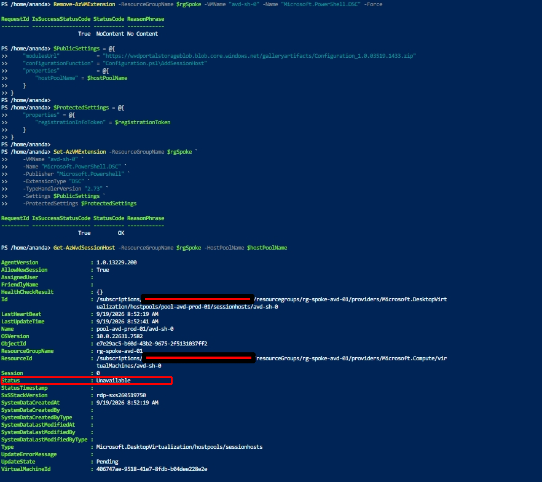
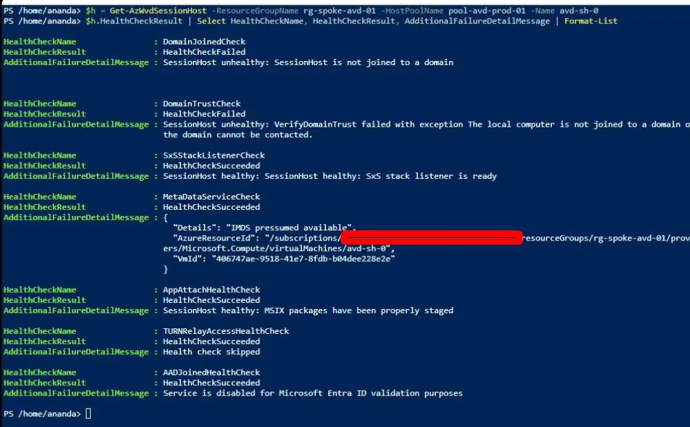
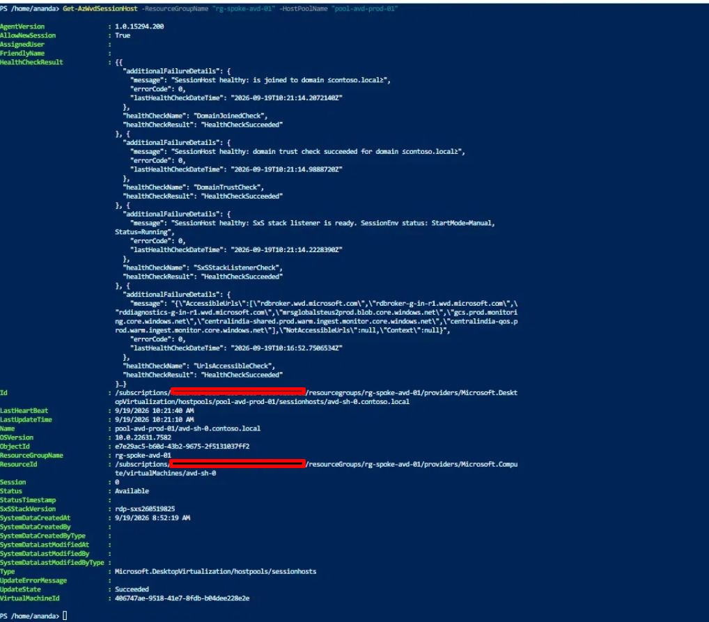
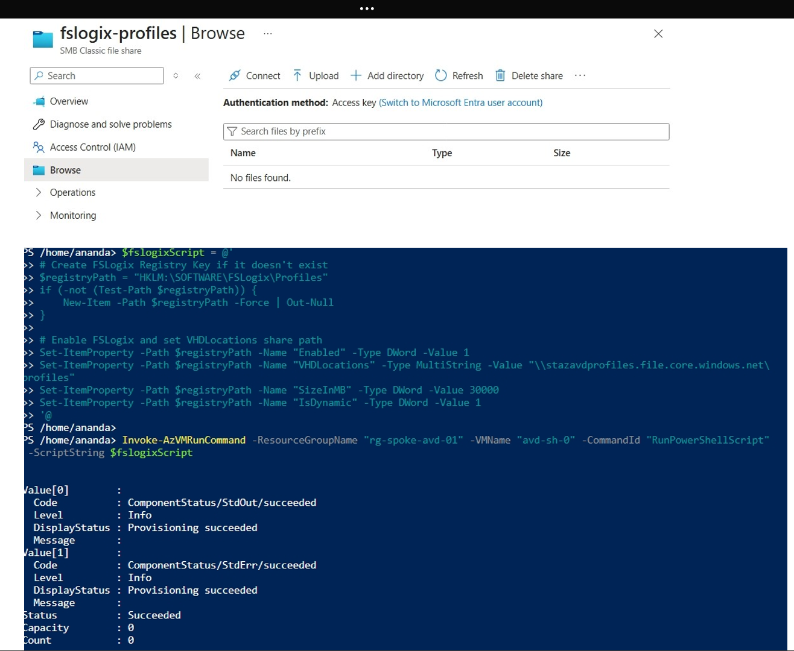
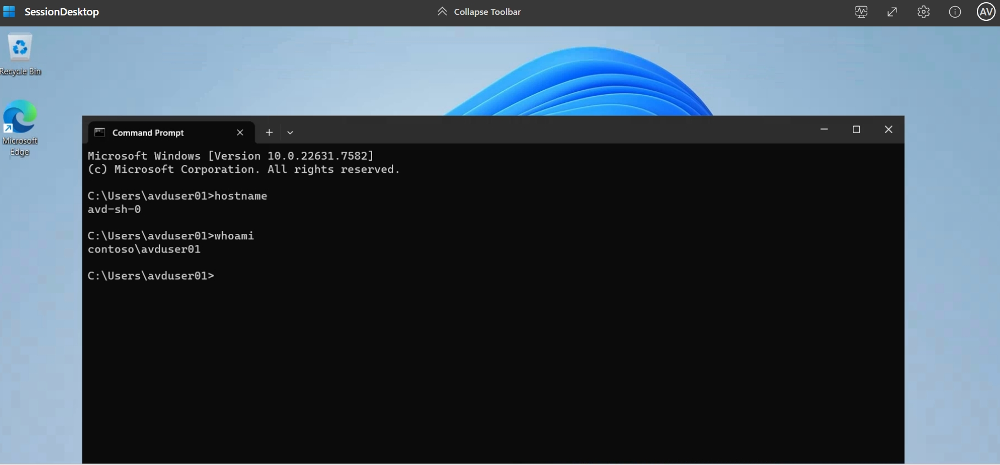
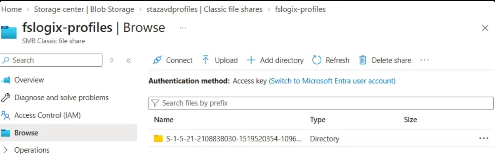

# Phase 5: AVD Host Pool, Session Host and FSLogix

**Status:** Done. A domain user signs in through the Windows App to a domain-joined session host
and an FSLogix profile container is created on Azure Files. Egress uses a NAT Gateway rather than
the NVA (see [Phase 8](../phase-8-nva-troubleshooting/README.md)).

## Scope

- AVD host pool, application group and workspace
- One session host (`avd-sh-0`) registered to the host pool
- Domain join to contoso.local
- FSLogix profile containers on the Azure Files share from Phase 4
- End-to-end user sign-in test

## Architecture

| Item | Value |
|---|---|
| Host pool | pool-avd-prod-01 |
| Application group | ag-avd-desktop-01 (desktop) |
| Workspace | workspace-avd-prod-01 |
| Session host | avd-sh-0, Windows 11 multi-session with Microsoft 365 (`win11-23h2-avd-m365`) |
| Subnet | snet-avd-sessionhosts (10.210.1.0/24) |
| Egress | NAT Gateway (natgw-avd-spoke), route table detached |
| Profile share | \\stazavdprofiles.file.core.windows.net\fslogix-profiles |

## Implementation

### 1. Session host deployment failed

The VM and NIC deployed, but the DSC extension (`Microsoft.PowerShell.DSC`) failed to download
its configuration package after 17 attempts:

    Unable to connect to the remote server ... Configuration_1.0.03519.1433.zip

The VM had no working outbound path: the subnet's default route pointed at the NVA, and the
NVA does not forward spoke traffic. The template also carried a placeholder registration token
(`PLACEHOLDER_DO_NOT_USE`), so the extension would have failed on registration even with
connectivity.

### 2. Diagnosis

Effective routes on the NIC showed `0.0.0.0/0 -> VirtualAppliance 10.200.1.4`. A test from the
VM confirmed the target was unreachable (`TcpTestSucceeded : False`). Network Watcher
connection troubleshoot reported 316 of 316 probes failed. The investigation of why the NVA path
fails became [Phase 8](../phase-8-nva-troubleshooting/README.md).

### 3. Workaround: NAT Gateway

A NAT Gateway was attached to the subnet and the route table was detached. The same test then
succeeded:

    TcpTestSucceeded : True

(A UDR to a virtual appliance overrides a NAT Gateway on the same subnet, so the route table
had to come off.)

### 4. Redeploy the DSC extension with a real registration token

The failed extension was removed, then re-added with a registration token generated for the
host pool. The token is not committed; it expires and is treated as spent after use.

    Remove-AzVMExtension -ResourceGroupName rg-spoke-avd-01 -VMName avd-sh-0 -Name Microsoft.PowerShell.DSC -Force
    Set-AzVMExtension -ResourceGroupName rg-spoke-avd-01 -VMName avd-sh-0 -Name Microsoft.PowerShell.DSC `
      -Publisher Microsoft.Powershell -ExtensionType DSC -TypeHandlerVersion 2.73 `
      -Settings $PublicSettings -ProtectedSettings $ProtectedSettings

The session host registered in the pool but showed `Unavailable`.

### 5. Health checks: not domain joined

The host pool's health checks pinpointed the remaining problem:

| Check | Result |
|---|---|
| DomainJoinedCheck | Failed: session host is not joined to a domain |
| DomainTrustCheck | Failed: domain cannot be contacted |
| SxSStackListenerCheck, MetaDataServiceCheck, AppAttachHealthCheck | Succeeded |

The host had been deployed as a workgroup machine, and the spoke had no path to the domain
controller. Phase 2b (direct peering to the on-prem VNet and DNS set to the DC) fixed the
network. Before joining, connectivity was verified from the host:

    Resolve-DnsName contoso.local          -> 10.100.1.4
    Test-NetConnection 10.100.1.4 -Port 389 -> True
    Test-NetConnection 10.100.1.4 -Port 445 -> True

### 6. Domain join

The first join attempt with an explicit OU path failed with a generic error
(`FailToJoinDomainFromWorkgroup`, "The system cannot find the file specified"), which usually
means the OU path is wrong. Joining without `-OUPath` and moving the computer object afterwards
worked. After a restart, the host health checks passed and the session host showed Available.

### 7. FSLogix configuration

FSLogix was enabled with registry values on the host:

    HKLM:\SOFTWARE\FSLogix\Profiles
      Enabled      = 1
      VHDLocations = \\stazavdprofiles.file.core.windows.net\fslogix-profiles
      SizeInMB     = 30000
      IsDynamic    = 1

The first attempt pointed at `...\profiles`, a share that does not exist, so no profile was
created. Correcting the path and signing out fully, then back in, produced the profile folder.

## Verification

`contoso\avduser01` signed in through the Windows App and reached the desktop:

    hostname -> avd-sh-0
    whoami   -> contoso\avduser01

A profile folder named after the user's SID appeared on the share.

[If you screenshotted it: the `.vhdx` file inside the folder is the definitive proof the
container mounted. Add it as `10-phase5-fslogix-vhdx.png`.]

## Issues and fixes

| Issue | Cause | Fix |
|---|---|---|
| DSC extension failed to download | No outbound path (UDR to a non-forwarding NVA) | NAT Gateway on the subnet, route table detached |
| Run Command blocked (409 Conflict) | The failed DSC extension was still in progress | Remove the extension, then retry |
| Session host `Unavailable` | Not domain joined, no route to the DC | Phase 2b peering and DNS, then domain join |
| Domain join error | OU path | Join without `-OUPath`, move the object afterward |
| No FSLogix profile | `VHDLocations` pointed at the wrong share name | Corrected to `fslogix-profiles`, full sign-out and sign-in |

## Known limitations

- **Egress bypasses the NVA.** The NAT Gateway carries outbound traffic, so there is no
  inspection point. See Phase 8.
- **The host reaches the domain controller over direct peering**, not through the hub.
- **The image (`win11-23h2-avd-m365`) is approaching end of servicing.** A current build
  (24H2 or later, where available in the region) would be the choice for a real deployment.
- **One session host**, no scaling plan and no host pool autoscale.
- The registration token was generated and used in a shell session; it is not stored in the
  repository.

## Lessons

- "Available" in the portal comes from health checks; read them
  (`Get-AzWvdSessionHost | Select -Expand HealthCheckResult`) instead of waiting.
- A stopped Run Command with a 409 usually means another extension is mid-operation.
- FSLogix creates the profile folder only at sign-in, so a full sign-out and sign-in is part of
  every configuration change.
- Deploy AVD only after the paths it depends on (egress, DNS, the domain controller) have been
  tested from a workload VM.

---

Before you commit it

Image list. I invented ten filenames that follow the convention. Match them to what you actually saved: the deployment failure (vmCreation-linkedTemplate screenshot), the connection troubleshoot, the egress test, the health checks (the DomainJoinedCheck failed output), the Available status, the FSLogix registry script, the hostname and whoami session, and the profile folder. Delete any image line you don't have a file for.

Task order. I placed the NAT Gateway step before the DSC redeploy, as it happened. You created the DSC extension again after the NAT Gateway existed, but you also removed the route table then, so keep those two steps together.

The Set-AzVMExtension command is from your Cloud Shell screenshot. I dropped the variables' contents ($PublicSettings, $ProtectedSettings) on purpose. The ProtectedSettings block contains the registration token, so never paste it.

The TypeHandlerVersion 2.73 matches what you used. The DSC extension version may change, so note the date.

Blur the subscription and tenant details in the screenshots, and check that none shows the registration token.

Item I couldn't confirm: the "join without -OUPath" fix. Your second attempt's output wasn't in the chat, only the health check afterward showing the host joined, so check what you actually ran. Remove the sentence if you used a corrected OU path instead.