# Phase 6: SecOps Hardening (PIM, Conditional Access, Sentinel, SOAR)

**Status:** Done. Sign-in and Windows security events reach Microsoft Sentinel, a custom
analytics rule raises an incident, and an automation rule runs a playbook that sends an
email. PIM and Conditional Access are enforced with a break-glass account excluded.

## Scope

- Break-glass account
- Privileged Identity Management (just-in-time admin role)
- Conditional Access (MFA for AVD users, legacy authentication blocked)
- Log Analytics workspace and Microsoft Sentinel
- Data collection from the session host and from Entra ID
- A detection rule, and an automated response

## Architecture

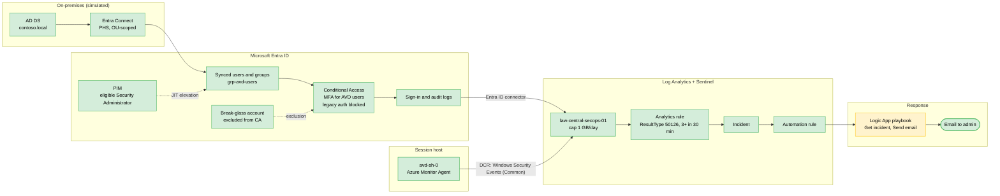

| Item | Value |
|---|---|
| Workspace | law-central-secops-01 (rg-hub-network-01, Central India, PerGB2018) |
| Ingestion cap | 1 GB/day |
| Sentinel | Free trial 20 Sep to 21 Oct 2026 (10 GB/day free during the trial) |
| Data collection rule | dcr-avd-winsecurity, Windows Security Events via AMA, "Common" set, target avd-sh-0 |
| Entra connector | Sign-in logs and audit logs |
| Analytics rule | Multiple failed sign-ins (avd users) |
| Playbook | pb-notify-failed-signin (Logic App, Consumption) |
| Portal | Sentinel is now managed in the Microsoft Defender portal (security.microsoft.com) |

## Implementation

### 1. Break-glass account

A cloud-only Global Administrator (`breakglass01`) with a long random password stored offline,
excluded from every Conditional Access policy. It is not exempt from the platform-level MFA
requirement on the Azure portal, so it needed an MFA method registered before it could sign
in. In production this would be a FIDO2 key; in the lab it is an authenticator app.

Sign-in with the account showed both Conditional Access policies as "Not applied", which
confirms the exclusion.

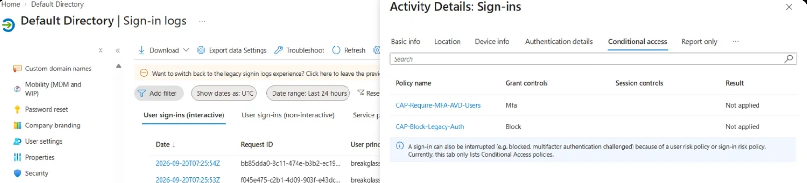

### 2. Privileged Identity Management

Security Administrator was made eligible rather than active for the admin account, with
justification and MFA required on activation and a maximum activation duration of [8 hours].
An activation was performed and is shown as Activated with start and end times.

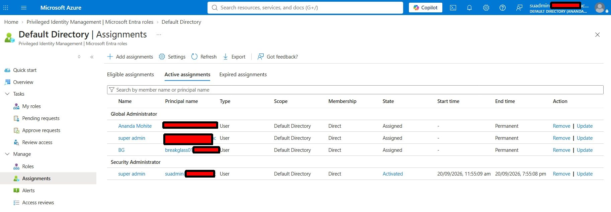

**What PIM does not cover here:** the Global Administrator assignments for the owner accounts
and the break-glass account remain permanent. Break-glass must stay permanent; the others were
left for lab recovery.

### 3. Conditional Access

| Policy | Scope | Control | State |
|---|---|---|---|
| CAP-Require-MFA-AVD-Users | grp-avd-users, all resources | Require MFA | On |
| CAP-Block-Legacy-Auth | All users, legacy client apps (Exchange ActiveSync, other clients), all resources, break-glass excluded | Block | On |

Both were created in report-only mode first. A sign-in by the test user showed the MFA policy
as `Report-only: Success` and the legacy policy as `Not applicable`. The legacy policy was
initially created with no target resources, which meant it would never have applied to
anything; caught in the policy details and corrected to All resources.

After enabling, the same sign-in showed the MFA policy in the **Conditional access** tab
(not just Report only) as `Success`.

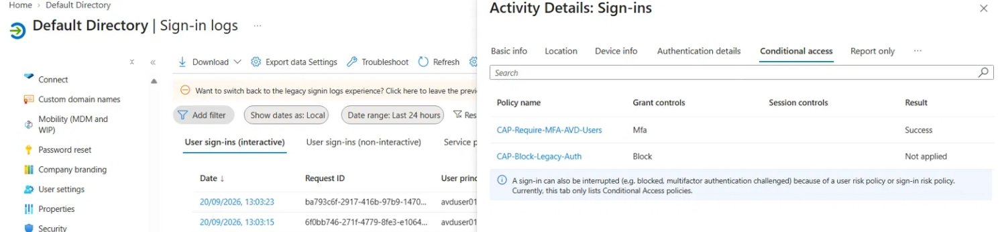
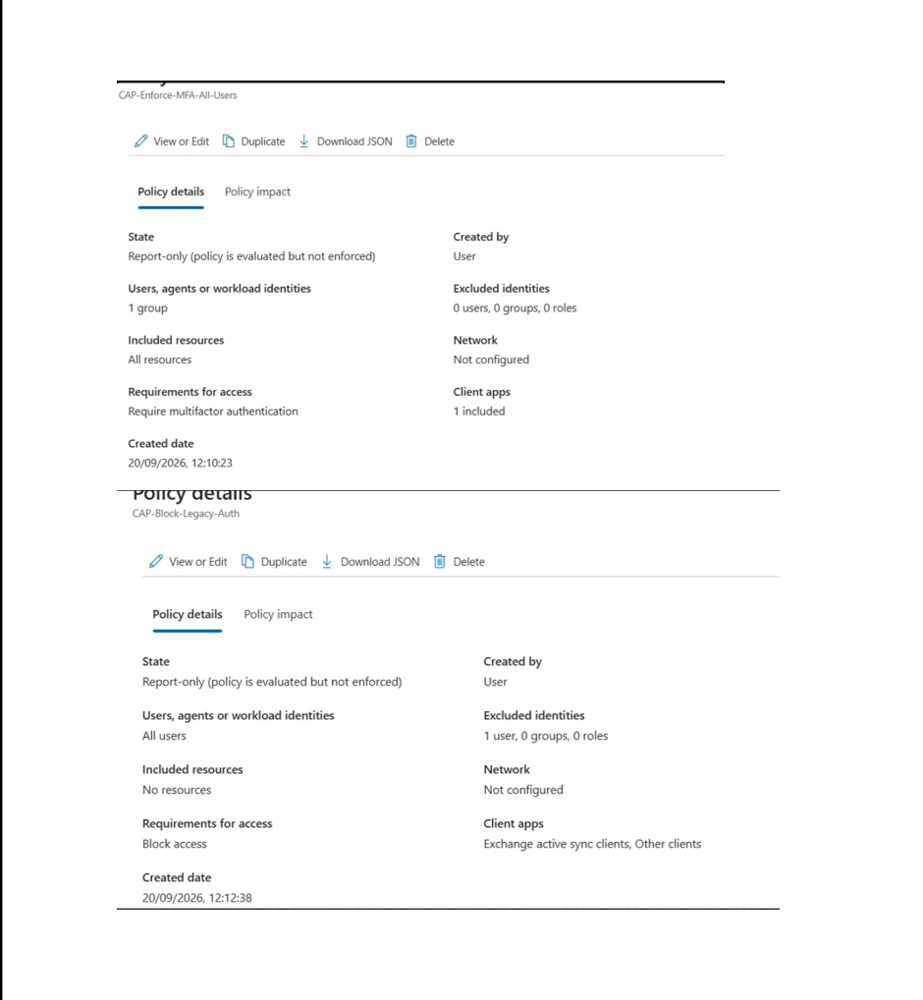

### 4. Workspace and Sentinel

    New-AzOperationalInsightsWorkspace -ResourceGroupName rg-hub-network-01 -Name law-central-secops-01 -Location centralindia -Sku PerGB2018
    Set-AzOperationalInsightsWorkspace -ResourceGroupName rg-hub-network-01 -Name law-central-secops-01 -DailyQuotaGb 1

Sentinel was enabled on the workspace and the free trial activated.

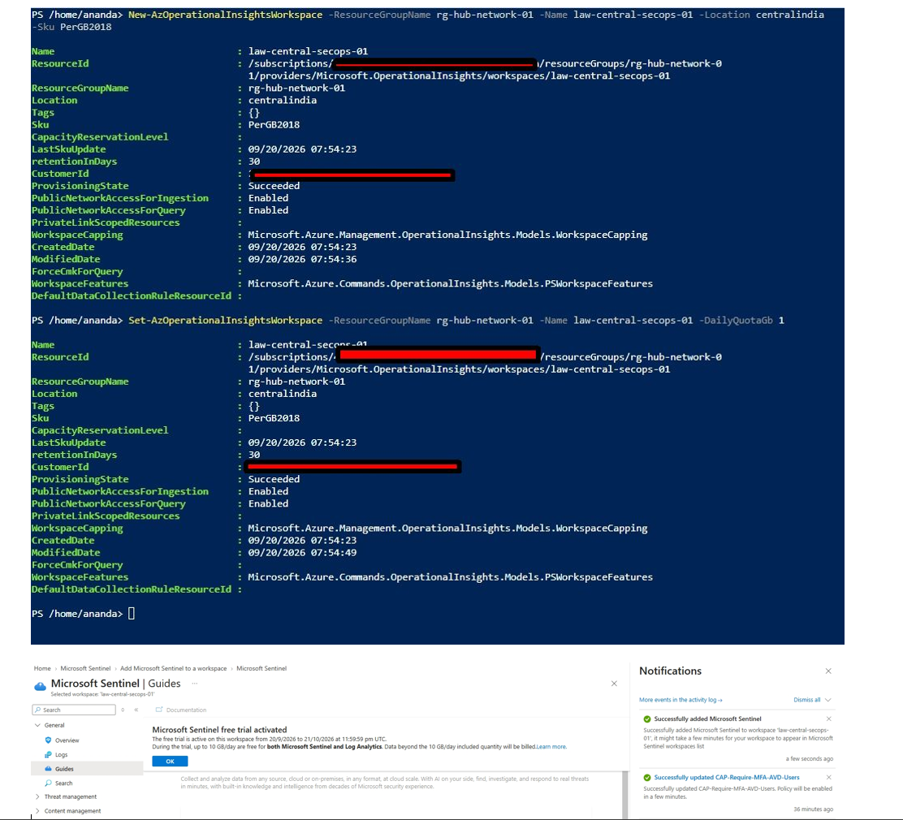

### 5. Data collection

Connectors have to be installed from the Content hub before they can be configured. The
Windows Security Events solution and the Entra ID solution were installed, then:

- A data collection rule (dcr-avd-winsecurity) associated with avd-sh-0, which installed the
  Azure Monitor Agent extension.
- The Entra ID connector configured for sign-in logs and audit logs.

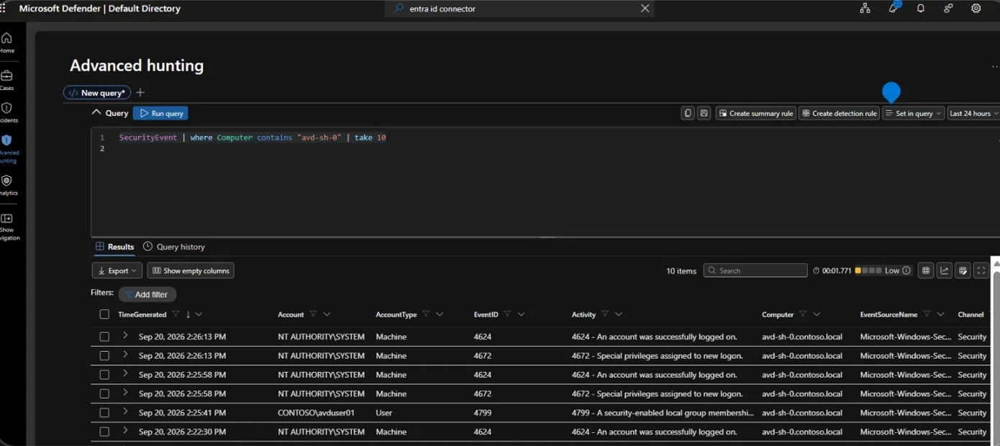

Verification in Advanced hunting:

    SecurityEvent | where Computer contains "avd-sh-0" | take 10
    SigninLogs    | where UserPrincipalName startswith "avduser01" | take 10

`SecurityEvent` returned events from avd-sh-0, including a user event for
`CONTOSO\avduser01` (4799). `SigninLogs` returned the user's sign-ins. Note the sign-in log
also shows non-failures with a failure code: `50074` (MFA challenge) and `50140` (the "stay
signed in" prompt). These are normal parts of an MFA sign-in and are why the detection below
uses a specific code.

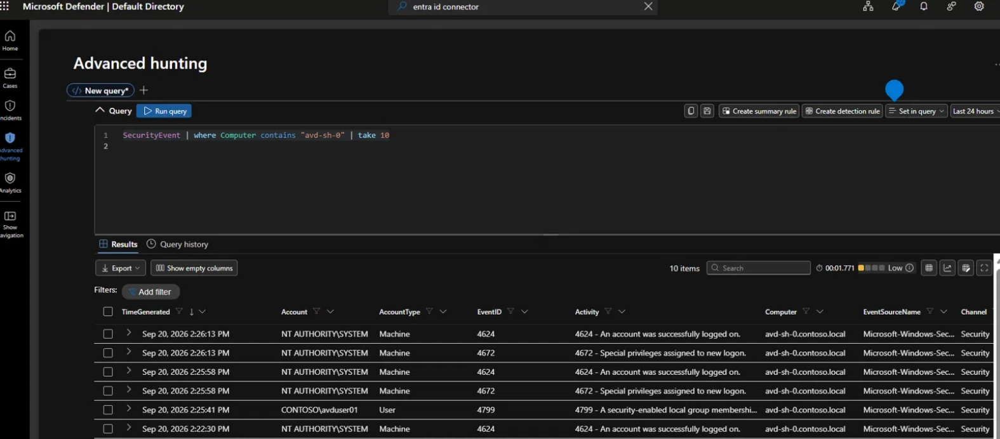
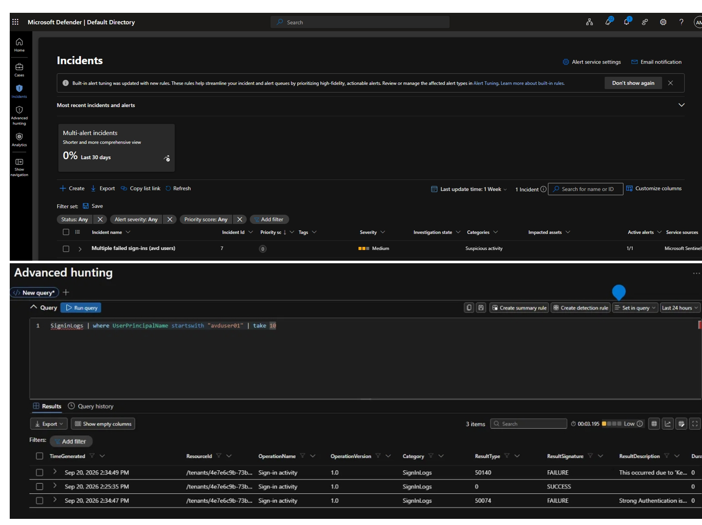

### 6. Detection rule

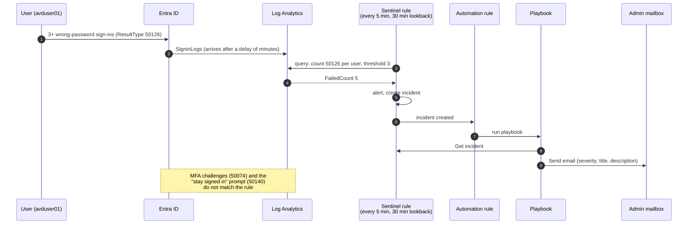

    SigninLogs
    | where ResultType == 50126
    | summarize FailedCount = count() by UserPrincipalName
    | where FailedCount >= 3

Runs every 5 minutes over the last 30 minutes, medium severity, incident creation on. `50126`
is "invalid username or password", so normal MFA challenges do not trigger it.

The first version used `bin(TimeGenerated, 5m)` with a 10-minute lookback. The test failures
were at 14:54:44, 14:55:10 and 14:55:50: two events fell in one 5-minute bin and one in the
next, so no bin ever reached three and nothing fired. Removing the bin and widening the
lookback to 30 minutes (to absorb Entra log ingestion delay) fixed it.

Three wrong-password attempts against the test user produced the incident, with a count of 5
for `avduser01` over the lookback window.

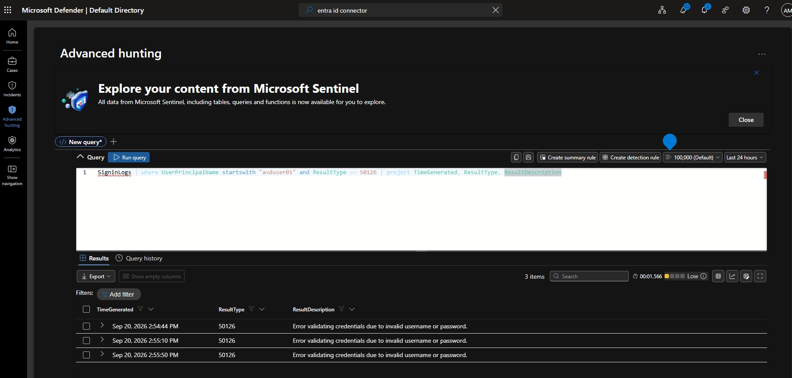
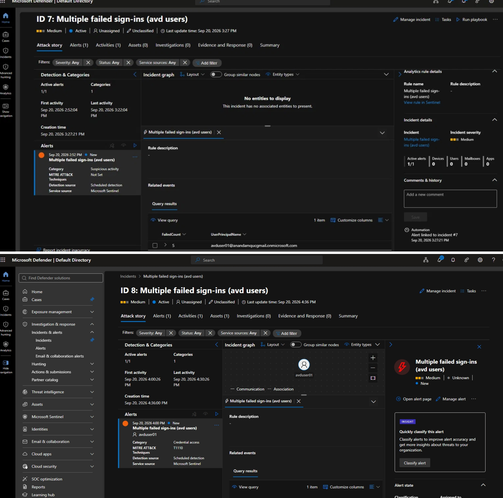

### 7. Automated response

A Logic App playbook (pb-notify-failed-signin) with three steps: the Microsoft Sentinel
incident trigger, Get incident, and Send email (V2) with severity, title and description.
The connection uses a user OAuth sign-in.

An automation rule triggers it when an incident is created from the analytics rule. The
playbook was first run manually from the incident page (run succeeded, 3.3 seconds). On the
next incident the run started by itself at the moment the incident was created, and the
email arrived without any action.

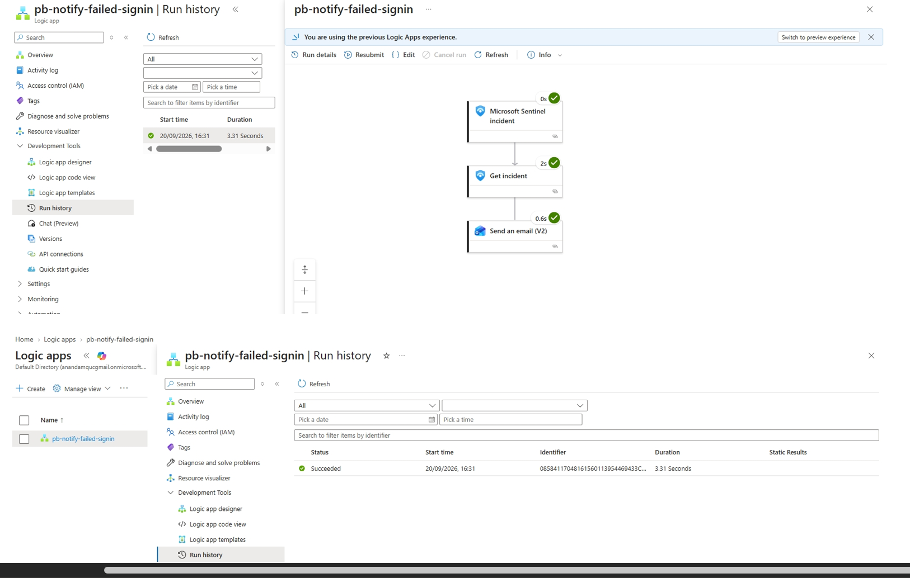
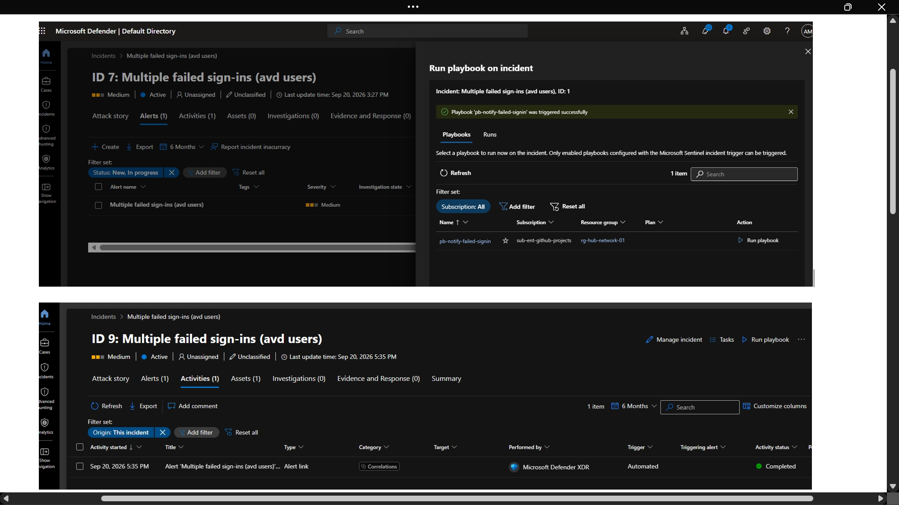
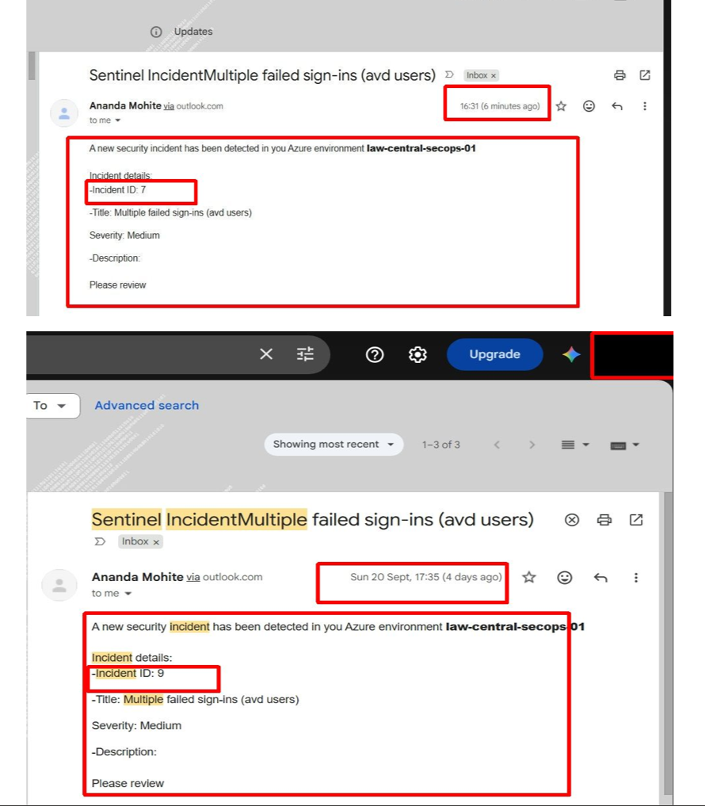

## Verification summary

| Check | Result |
|---|---|
| Events from the session host in Sentinel | Yes |
| Entra sign-in logs in Sentinel | Yes |
| PIM activation performed | Yes |
| Conditional Access enforced, break-glass excluded | Yes |
| Detection rule produced an incident | Yes |
| Playbook ran automatically and the email arrived | Yes |
| Ingestion cap set | 1 GB/day |

## Issues and fixes

| Issue | Cause | Fix |
|---|---|---|
| Entra connector not found in Data connectors | Connectors must be installed from the Content hub first | Install the solution, then configure |
| Sentinel menus differed from the docs | Sentinel moved to the Defender portal | Use security.microsoft.com |
| Break-glass account forced to register MFA | Platform-level MFA on the Azure portal, separate from Conditional Access | Register an MFA method; note FIDO2 for production |
| Report only tab showed "Not applicable" | The sign-in predated the policy | Generate a new sign-in after the policy exists |
| Legacy-auth policy would never fire | Target resources were "No resources" | Set to All resources |
| Detection rule never fired | Fixed 5-minute bins split the failures; short lookback vs log delay | Removed the bin, 30-minute lookback |
| Alerts page showed 0 | Incidents, not alerts, is where the Sentinel incident lands | Check Incidents |
| Duplicate incidents from one test | No suppression, overlapping lookback windows | [Suppression for 1 hour, or note as a follow-up] |

## Known limitations

- **The playbook uses a user OAuth connection.** It runs as that user and the token can
  expire. A managed identity with Sentinel Responder is the production choice.
- **PIM covers one role.** Global Administrator remains permanent for the lab accounts.
- **The incident has no entity mapping** (the incident graph is empty) and no MITRE technique.
  Adding an Account entity and Credential Access / T1110 is a small follow-up.
- **The detection is deliberately simple:** one rule for one condition, and the Defender for
  Cloud paid plans were not enabled to avoid cost (foundational CSPM only).
- **The trial ends 21 October 2026.** Beyond the free volume Sentinel and Log Analytics bill.
- The test user is synced from on-premises AD, so repeated failed sign-ins count against the
  AD lockout policy.

## Lessons

- A rule that produced no alert is not necessarily broken. Check the run history, then the
  time window against ingestion delay, then the binning.
- Report-only evidence and enforced evidence are different screens. Capture the enforced one.
- Exclude a break-glass account from every policy before enabling anything, then test it.
- Read the whole chain (event, rule, incident, automation, playbook run, email) rather than
  trusting one green tick.

---
## Before you commit it

Image list. I made up thirteen filenames. Match them to what you saved, and delete any line you have no file for. The two most important are 03 (the enforced Conditional access tab with Success) and 10 (the incident detail with the avduser01 count).

The PIM duration. Your activation window showed 11:55 am to 7:55 pm, which is eight hours, so I wrote "[8 hours]". Keep that, or change the text if you configured a different maximum.

The suppression row says "[Suppression for 1 hour, or note as a follow-up]". You told me you did the Sentinel tidy-up (suppression and closing incidents 7 and 9) in the morning. If so, write that it's on, and add one screenshot. If not, leave it as a follow-up.

The playbook's first run. I described a manual run then an automatic one. Your Run history showed 16:31 (manual) and 17:35 (automatic, same minute as incident 9), and you confirmed the email arrived without action. If you don't have the automation rule screenshot, remove image 12 and say it was verified by the run history and the email.

Security. Blur the tenant domain, the break-glass UPN and any email in the screenshots. The avduser01 UPN contains your tenant name, so blur it too. Don't include the break-glass password or the MFA method details anywhere.

Cost claim: "10 GB/day free during the trial" comes from the trial notice you showed me, so recheck it against your notice before publishing.