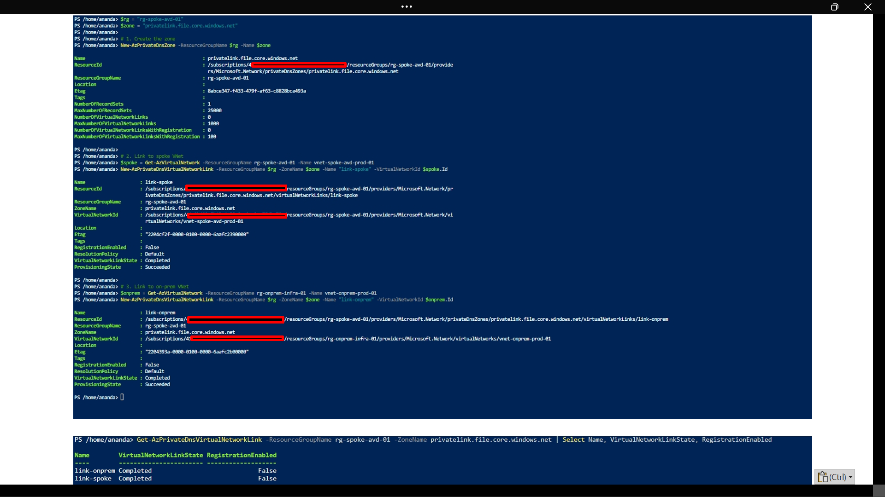
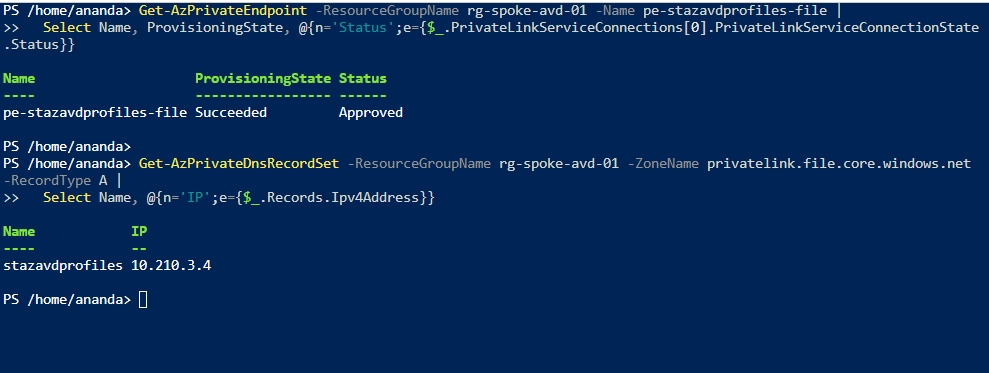
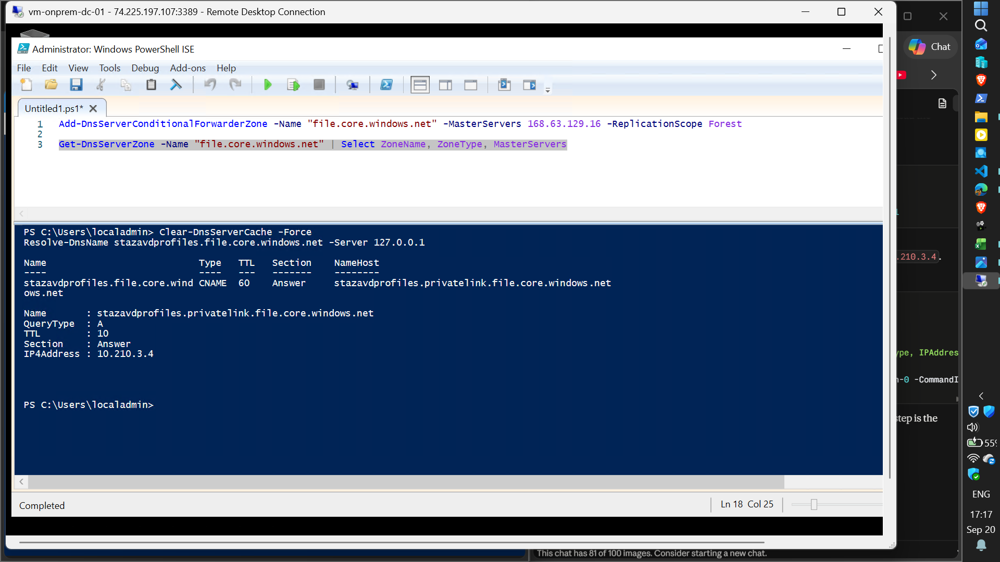
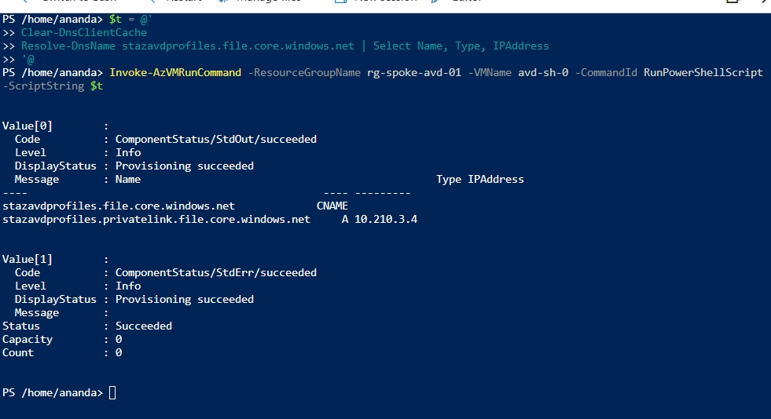
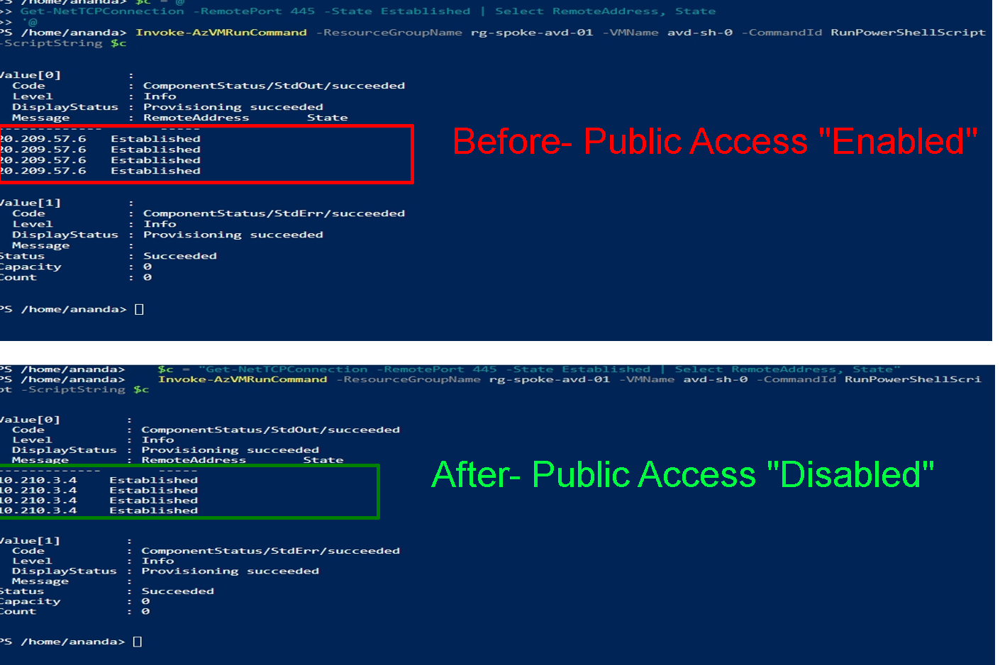
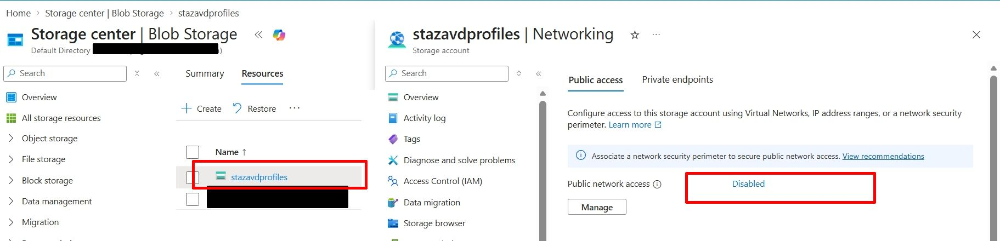
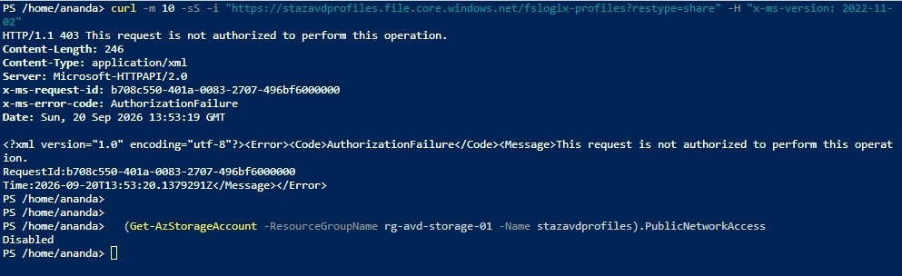
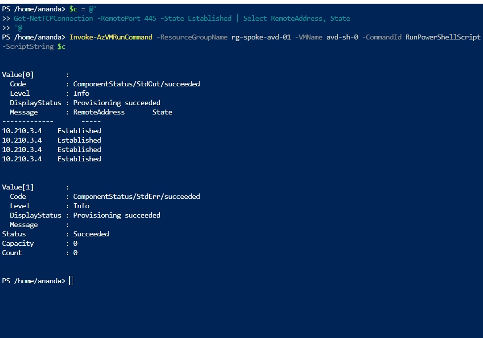
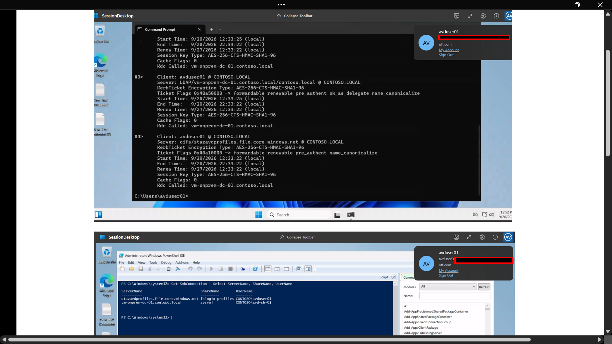

# Phase 7: Zero-Trust Storage (Private Endpoint and Private DNS)

**Status:** Done. FSLogix reaches the storage account over a private endpoint, and the public
endpoint is disabled.

## Why this phase exists

The roadmap put private endpoints in Phase 4, but Phase 4 finished on the public endpoint
because NTFS setup needed it. This phase closes that gap: storage is reachable only from inside
the network, and the name resolves to a private address from both the session host and the
domain controller.

## Architecture

| Item | Value |
|---|---|
| Storage account | stazavdprofiles (rg-avd-storage-01) |
| Endpoint subnet | snet-private-endpoints, 10.210.3.0/24 (spoke VNet) |
| Private endpoint | pe-stazavdprofiles-file, sub-resource `file`, IP 10.210.3.4 |
| Private DNS zone | privatelink.file.core.windows.net |
| Zone links | link-spoke (spoke VNet), link-onprem (on-prem VNet), auto-registration off |
| DC forwarder | file.core.windows.net -> 168.63.129.16 |

The session host and the domain controller both use the DC (10.100.1.4) as their DNS server.
The DC forwards queries for `file.core.windows.net` to Azure DNS (168.63.129.16), which answers
from the private zone. That only works if the zone is linked to the VNet the DC lives in, which
is why the zone has a link to the on-prem VNet as well as the spoke.

## Implementation

Commands are PowerShell (Azure CLI equivalents work as well).

### 1. Endpoint subnet

    $vnet = Get-AzVirtualNetwork -ResourceGroupName rg-spoke-avd-01 -Name vnet-spoke-avd-prod-01
    Add-AzVirtualNetworkSubnetConfig -Name snet-private-endpoints -AddressPrefix 10.210.3.0/24 -VirtualNetwork $vnet
    $vnet | Set-AzVirtualNetwork

The `Add-` cmdlet only edits the in-memory object; `Set-` writes it to Azure.

### 2. Private DNS zone and links

    New-AzPrivateDnsZone -ResourceGroupName rg-spoke-avd-01 -Name privatelink.file.core.windows.net
    New-AzPrivateDnsVirtualNetworkLink -ResourceGroupName rg-spoke-avd-01 -ZoneName privatelink.file.core.windows.net `
      -Name link-spoke  -VirtualNetworkId $spoke.Id
    New-AzPrivateDnsVirtualNetworkLink -ResourceGroupName rg-spoke-avd-01 -ZoneName privatelink.file.core.windows.net `
      -Name link-onprem -VirtualNetworkId $onprem.Id

Both links show `Completed` with registration disabled.

### 3. Private endpoint with a DNS zone group

    $sa   = Get-AzStorageAccount -ResourceGroupName rg-avd-storage-01 -Name stazavdprofiles
    $conn = New-AzPrivateLinkServiceConnection -Name conn-stazavdprofiles-file -PrivateLinkServiceId $sa.Id -GroupId file
    $pe   = New-AzPrivateEndpoint -ResourceGroupName rg-spoke-avd-01 -Name pe-stazavdprofiles-file `
              -Location centralindia -Subnet $subnet -PrivateLinkServiceConnection $conn
    $zone = Get-AzPrivateDnsZone -ResourceGroupName rg-spoke-avd-01 -Name privatelink.file.core.windows.net
    $cfg  = New-AzPrivateDnsZoneConfig -Name privatelink-file-core-windows-net -PrivateDnsZoneId $zone.ResourceId
    New-AzPrivateDnsZoneGroup -ResourceGroupName rg-spoke-avd-01 -PrivateEndpointName pe-stazavdprofiles-file `
      -Name file-dns-group -PrivateDnsZoneConfig $cfg

The endpoint is `Succeeded` and `Approved`, and the zone contains an A record
`stazavdprofiles -> 10.210.3.4`.

### 4. Conditional forwarder on the domain controller

    Add-DnsServerConditionalForwarderZone -Name file.core.windows.net -MasterServers 168.63.129.16 -ReplicationScope Forest

This runs on the domain controller (locally or through Run Command). Cloud Shell has no DNS
Server module, so running it there fails with "term not recognized".

### 5. Name resolution from both sides

Both the DC and the session host resolve the storage name through the privatelink CNAME to the
private address:

    stazavdprofiles.file.core.windows.net          CNAME  stazavdprofiles.privatelink.file.core.windows.net
    stazavdprofiles.privatelink.file.core.windows.net  A  10.210.3.4

### 6. FSLogix over the private path

Established SMB connections moved from the public address to the private one only after the
user signed out fully and back in. Existing SMB connections stay on the address they were
opened with, so flushing DNS alone does not move them.

    Before: RemoteAddress 20.209.57.6  Established  (public)
    After : RemoteAddress 10.210.3.4   Established  (private endpoint)

### 7. Disable public network access

    Set-AzStorageAccount -ResourceGroupName rg-avd-storage-01 -Name stazavdprofiles -PublicNetworkAccess Disabled

## Verification

**From outside the network** (Cloud Shell, which sits outside the VNets):

    curl -i "https://stazavdprofiles.file.core.windows.net/fslogix-profiles?restype=share" -H "x-ms-version: 2022-11-02"
    HTTP/1.1 403 This request is not authorized to perform this operation.
    x-ms-error-code: AuthorizationFailure

`AuthorizationFailure` is the network-level refusal. With public access open and no
credentials the response would be `AuthenticationFailed`, which means the request got past the
network layer. (A plain `curl` to the root URL returns `400`, which says nothing about network
access and should not be used as a test.)

**From inside:** `contoso\avduser01` signs in with public access disabled and the profile
still mounts, with SMB connections to 10.210.3.4.

**Kerberos:** `Get-SmbConnection` inside the user's session shows the share authenticated as
`CONTOSO\avduser01`. The storage account reports `DirectoryServiceOptions : AD`.
[`klist` showed zero cached tickets in this environment, so it is not cited as proof.]

## Cleanup done in this phase

- Storage account keys rotated (both). They are not used by anything, since FSLogix
  authenticates with Kerberos. Evidence: the storage account's activity log entries for
  "Regenerate Storage Account Keys" [add screenshot].
- Domain administrator password changed.
- Management access on the lab VMs restricted or removed (public IPs on the domain controller
  and NVA) [confirm what you actually did].

## Issues and fixes

| Issue | Cause | Fix |
|---|---|---|
| DNS forwarder command failed in Cloud Shell | The DNS Server cmdlets exist only on the DC | Run it on the DC or through Run Command |
| Same forwarder command "failed" a second time | Zone already existed (error 9619), because it had already been created | Ignore; verify with `Get-DnsServerZone` |
| SMB still went to the public IP after DNS was correct | Existing connections keep the address they were opened with | Sign out fully, sign in again |
| `curl` to the storage root returned 400 | The request was malformed (no path, no auth); the response is not affected by network access | Test a real resource path and read the error code |
| `klist` showed no tickets | The check ran as SYSTEM, or no ticket had been requested | Run inside the user session; use `Get-SmbConnection` as evidence |

## Known limitations

- Portal file browsing and any tooling outside the VNets stop working once public access is off.
  Administrative access to the share now goes through a host inside the network.
- DNS for the private zone depends on the domain controller and its forwarder. If the DC is
  down, the session host cannot resolve the storage account privately.
- The private endpoint is in the spoke VNet, reached by the on-prem VNet through the direct
  peering. In a full hub-spoke design it would sit in the hub or a shared services VNet.

## Lessons

- A private endpoint plus a private DNS zone is not enough when clients use a custom DNS server.
  The forwarder, and a zone link on the VNet the forwarding DNS server lives in, are what make
  the name resolve privately.
- Verify by looking at where connections actually go (`Get-NetTCPConnection`), not just what
  DNS returns.
- Test the closed door from outside, and the open door from inside, in that order, before and
  after disabling public access.

---
Before you commit it

Image list. I made up nine filenames following the convention. Match them to what you saved: zone links, endpoint DNS configuration, DC forwarder, the two Resolve-DnsName outputs, the SMB connection checks (both the public and private ones), the Networking blade, the 403, the final sign-in, and Get-SmbConnection. Remove any image line you don't have a file for.

Two items I've left in brackets on purpose. I never saw what you did about the public IPs on the DC and NVA, and I never saw the key rotation itself, only that you did it. Write down what actually happened, or remove those bullets, and attach the activity log screenshot for the rotation.

The sign-in after disable. You said in the morning that you did the final sign-in test and took screenshots, so 08-phase7-signin-after-disable.png should exist. If it doesn't, downgrade the status line to "verified before disabling public access" until it does.

Commands. The step-by-step commands use $spoke, $onprem and $subnet variables from earlier lines (fetching each VNet and the endpoint subnet). Add those lines if you want the section to run on its own.

The public IP 20.209.57.6 appears in the SMB "before" line. It's the storage account's own public address, which is fine to publish, but I'd blur it anyway if you'd rather not show it.

Blur subscription IDs and tenant details in every screenshot, and make sure no screenshot shows storage keys. 