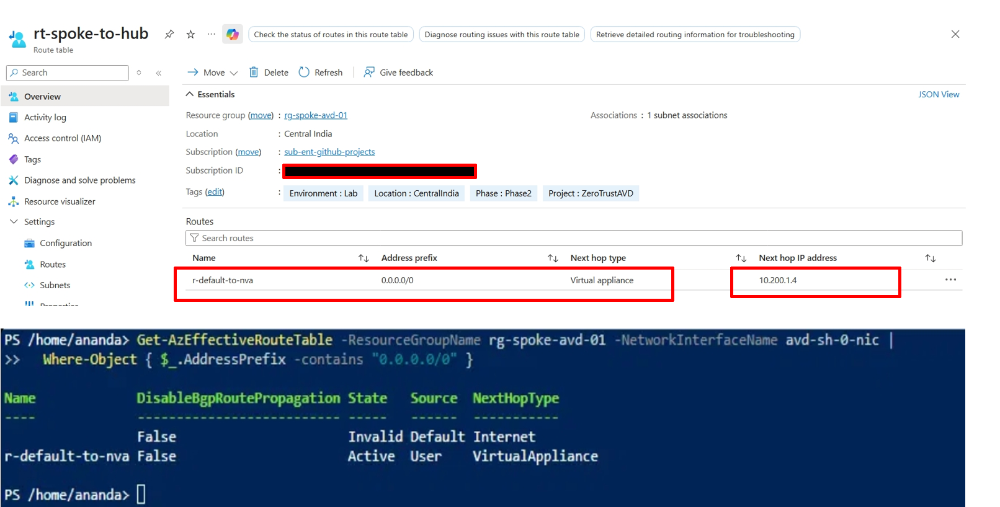
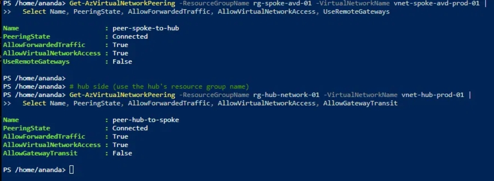
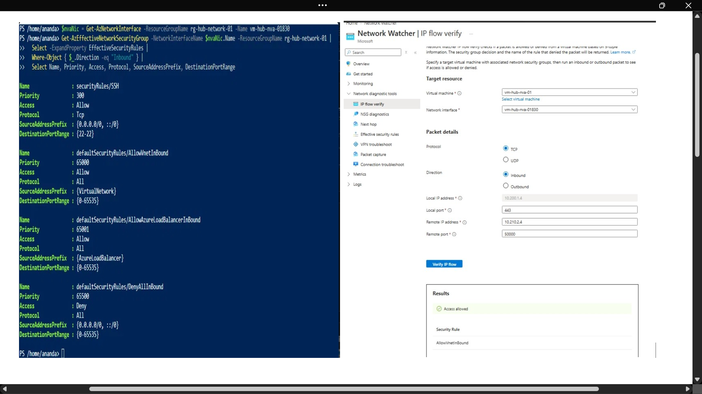
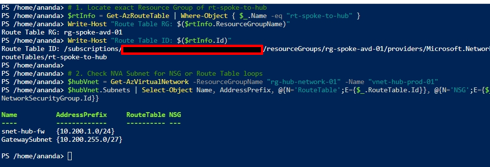
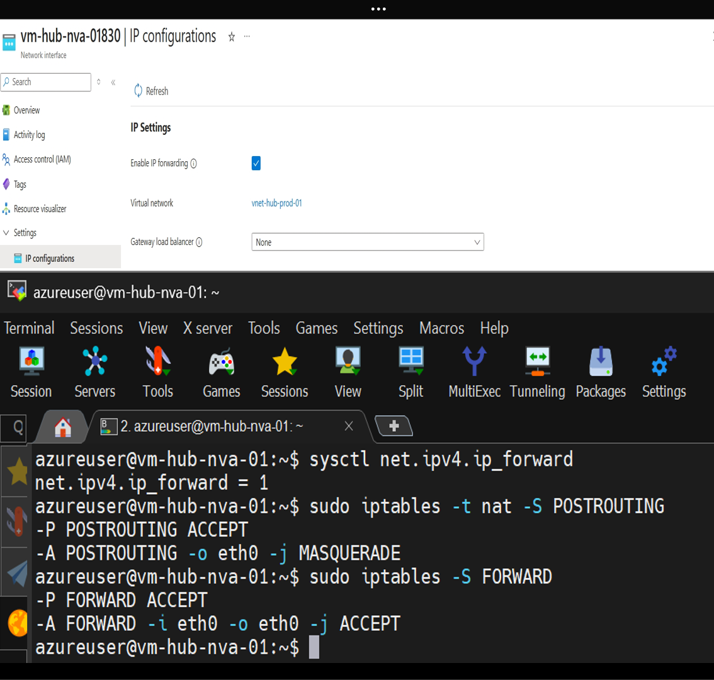
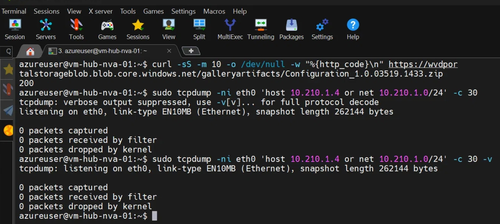
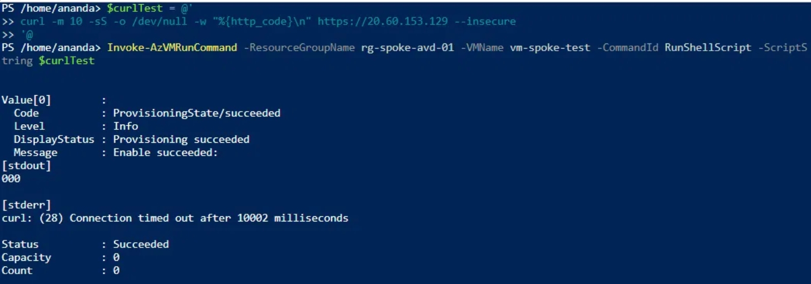
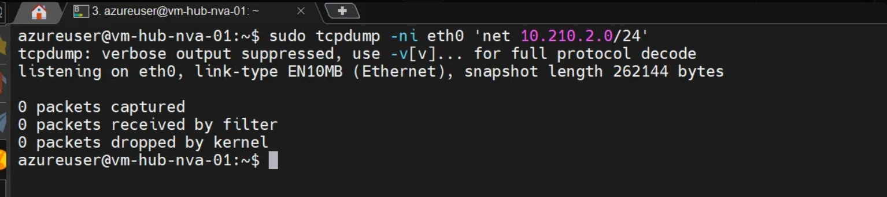
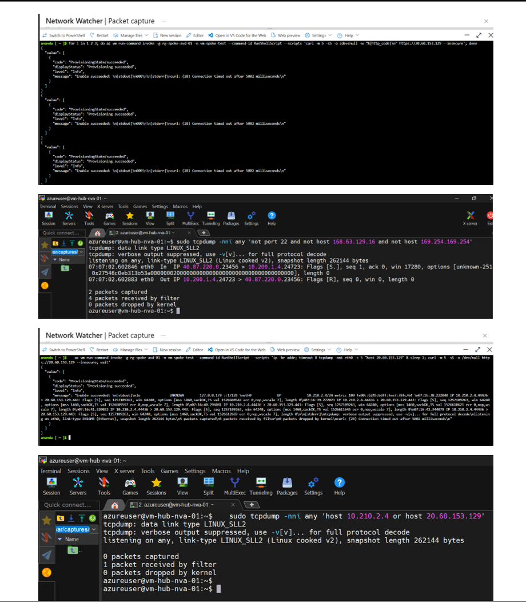

# Phase 8: NVA Path Troubleshooting (Case Study)

**Status:** Open. Escalated to Microsoft Q&A [Link](https://learn.microsoft.com/en-us/answers/questions/6016649/udr-next-hop-to-an-nva-in-a-peered-hub-vnet-packet). Workaround in use.

## Summary

Traffic from a spoke subnet routed by a user-defined route (UDR) to a Linux NVA in a peered
hub VNet never reaches the NVA. Every configuration check passes, the source VM emits the
packets, and the NVA's NIC sees none of them. The fault sits in the platform path between the
two NICs, or in something not visible from inside either VM. I could not resolve it, so
session-host egress uses a NAT Gateway instead.

## Topology

| Item | Value |
|---|---|
| Hub VNet | vnet-hub-prod-01 (10.200.0.0/16), subnet snet-hub-fw (10.200.1.0/24) |
| NVA | vm-hub-nva-01, Ubuntu 24.04, Standard_B1s, 10.200.1.4, single NIC (eth0) |
| Spoke VNet | vnet-spoke-avd-prod-01 (10.210.0.0/16) |
| Test subnet | snet-test (10.210.2.0/24) with rt-spoke-to-hub attached |
| Test VM | vm-spoke-test, Ubuntu 22.04, 10.210.2.4, no public IP |
| Route | r-default-to-nva: 0.0.0.0/0 -> VirtualAppliance 10.200.1.4 |
| Test target | 20.60.153.129:443 (the AVD DSC download host) |

## Symptom

The AVD session host's DSC extension failed to download its configuration package after 17
attempts ("Unable to connect to the remote server"). A test VM in a subnet with the same UDR
fails the same way:

    curl: (28) Connection timed out after 5002 milliseconds

## Investigation

### 1. Effective routes on the spoke NIC

Azure's own routing table says the packet should go to the NVA:

    0.0.0.0/0  ->  VirtualAppliance  10.200.1.4   State: Active
    (default Internet route: Invalid, overridden by the UDR)

### 2. Peering, both directions

    peer-spoke-to-hub  Connected  AllowForwardedTraffic: True  AllowVirtualNetworkAccess: True
    peer-hub-to-spoke  Connected  AllowForwardedTraffic: True  AllowVirtualNetworkAccess: True

### 3. NSG and IP flow verify

Effective security rules on the NVA NIC show no custom deny above the default
`AllowVnetInBound`. Network Watcher's IP flow verify (inbound, 10.210.2.4 -> 10.200.1.4:443)
confirms the platform considers the flow deliverable:

    Access allowed
    Security rule: AllowVnetInBound

### 4. Hub subnet: no route table, no NSG

The NVA's own subnet (snet-hub-fw) has neither a route table nor an NSG attached, ruling out
a loop or a subnet-level block on the hub side.

    Name         AddressPrefix     RouteTable   NSG
    snet-hub-fw  10.200.1.0/24     -            -
    GatewaySubnet 10.200.255.0/27  -            -

### 5. NIC forwarding and NVA OS configuration

    EnableIPForwarding: True

    sysctl net.ipv4.ip_forward       -> net.ipv4.ip_forward = 1
    iptables -t nat -S POSTROUTING   -> -A POSTROUTING -o eth0 -j MASQUERADE
    iptables -S FORWARD              -> -P FORWARD ACCEPT

### 6. The NVA reaches the internet itself

    curl -m 10 -sS -o /dev/null -w "%{http_code}\n" https://wvdportalstorageblob.blob.core.windows.net/...
    200

### 7. Reproduced on a second, isolated VM

A fresh Ubuntu VM (vm-spoke-test) in its own subnet, with the same UDR, fails the same way.
The sender-side capture shows the packets leaving the VM and never being answered:

    07:16:38 IP 10.210.2.4.44436 > 20.60.153.129.443: Flags [S], seq 1257109263
    07:16:39 IP 10.210.2.4.44436 > 20.60.153.129.443: Flags [S], seq 1257109263
    07:16:40 IP 10.210.2.4.44436 > 20.60.153.129.443: Flags [S], seq 1257109263
    07:16:41 IP 10.210.2.4.44436 > 20.60.153.129.443: Flags [S], seq 1257109263
    07:16:42 IP 10.210.2.4.44436 > 20.60.153.129.443: Flags [S], seq 1257109263
    curl: (28) Connection timed out after 5002 milliseconds

### 8. The decisive capture: nothing arrives at the NVA

The same window, captured on the NVA with the platform traffic filtered out:

    sudo tcpdump -nni any 'host 10.210.2.4 or host 20.60.153.129'
    0 packets captured

### 9. Host move: deallocate and start

The NVA was deallocated and started (a fresh host allocation), and the test was repeated with
the same result.

    az vm redeploy -g rg-hub-network-01 -n vm-hub-nva-01
    (OperationNotAllowed: not allowed while deallocated)
    az vm start -g rg-hub-network-01 -n vm-hub-nva-01
    -> VM running
    (same failure on retest)

## What was checked: summary table

| # | Layer | Check | Result |
|---|---|---|---|
| 1 | Route | Effective routes, spoke NIC | Active, VirtualAppliance 10.200.1.4 |
| 2 | Peering | Both directions | Connected, forwarded traffic allowed |
| 3 | NSG | Effective rules + IP flow verify | Allow, AllowVnetInBound |
| 4 | Hub subnet | Route table / NSG on snet-hub-fw | Neither attached |
| 5 | NIC forwarding | EnableIPForwarding | True |
| 6 | NVA OS | ip_forward, iptables, nftables | Correct on every check |
| 7 | NVA egress | curl from the NVA itself | HTTP 200 |
| 8 | Reproduction | Second, isolated VM | Same failure |
| 9 | Host move | Deallocate + start | Same failure |

## Things that were tried and did not help

- Re-saving and inspecting peerings, NIC forwarding, NSGs (all already correct).
- Deallocating and starting the NVA, which allocates it fresh.
- Testing by IP address rather than hostname, to remove DNS as a variable (the spoke VNet's DNS
  points to the domain controller).

## Limitations of the evidence

- **Network Watcher packet captures returned empty files**, even unfiltered, on a VM that was
  clearly passing traffic. That agent was not producing usable data on this VM, so those files
  are not cited as evidence.
- The two in-guest captures were taken minutes apart in some earlier runs. The paired run in
  sections 7 and 8 (sender and receiver in the same window) is the one relied on here.
- Only one NVA size (B1s) and one region (Central India) were tested.
- A redeploy of the NVA was attempted before the deallocate/start test and was refused
  because the VM was stopped; start-after-deallocate was used instead.

## What I would try next

Ordered by cost, cheapest first. I stopped here because the remaining steps each need a
redesign or a paid service, and the environment was torn down before I could run the cheap ones.

1. **Direct spoke-to-NVA baseline** (no UDR next hop): connect from the spoke VM to the NVA's
   private IP with a paired capture. It separates a peering-level fault from a UDR-handoff
   fault. Suggested in the Microsoft Q&A thread. Cost: minutes.
2. **Repeat the paired capture with both sides started before the test**, several attempts per
   run, to remove any timing doubt. Cost: minutes.
3. **Replace the NVA with a fresh VM** (different size, with accelerated networking) in the same
   subnet and repeat. Cost: a small VM and a reconfiguration.
4. **Two-NIC NVA design** (inside and outside interfaces). Cost: a hub redesign.
5. **Compare against Azure Firewall or a VPN gateway**, to see whether the fault is specific to
   a single-NIC NVA in a peered hub. Cost: a paid service, which the design avoided on purpose.

Steps 3 to 5 change the design rather than test the existing one, so the value of running them
depends on what steps 1 and 2 show.

## Workaround

- The session-host subnet uses a NAT Gateway for outbound access and has no route table.
- The session host reaches the domain controller through direct spoke-to-on-prem VNet peering
  (Phase 2b), bypassing the NVA.
- This works but bypasses the inspection point, so the "NVA as firewall" goal is not met.

## Lessons

- A phase can pass its own checklist and still fail the next phase. Phase 2 verified NVA
  configuration but never tested a spoke VM reaching the internet through it.
- A capture that returns zero packets is only evidence if the test ran while it was recording.
  Start captures first, run the test, then stop them.
- Read stderr, not just "Succeeded", in Run Command output.
- Check whether the diagnostic tool itself is working before trusting an empty result.
